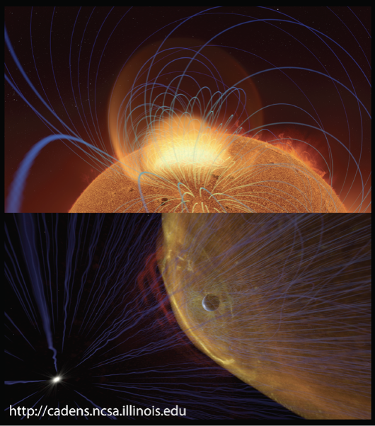
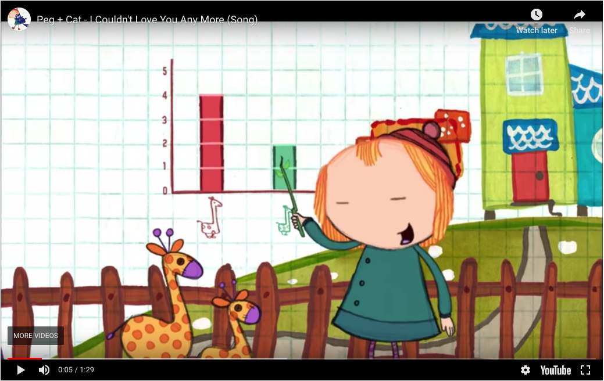
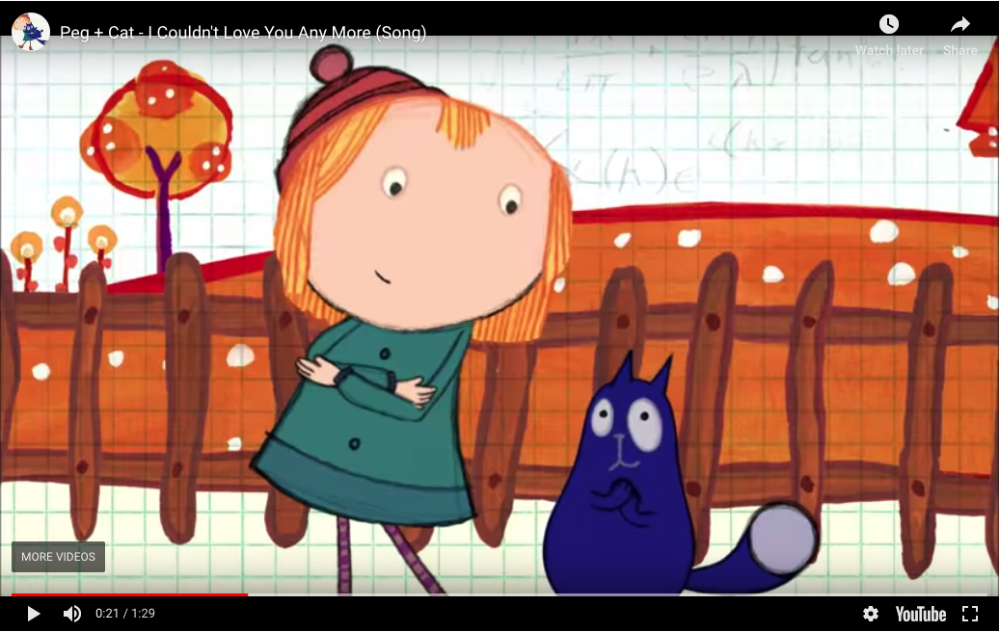
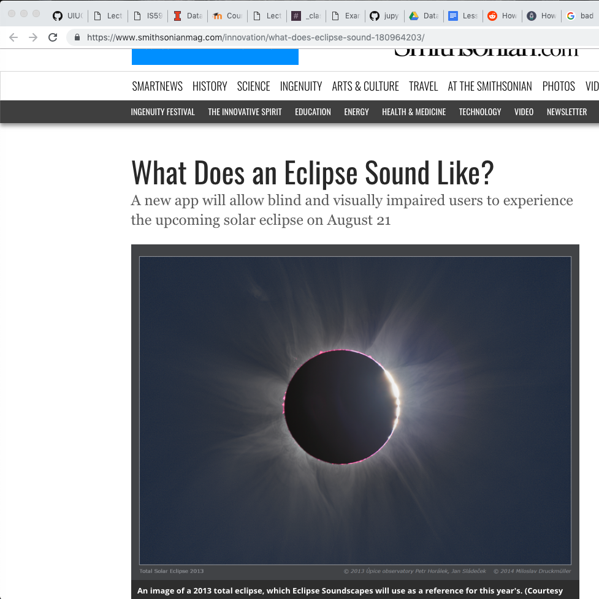
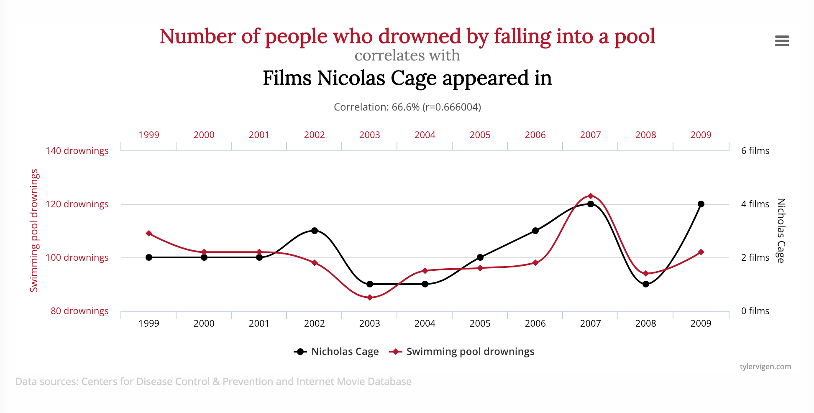
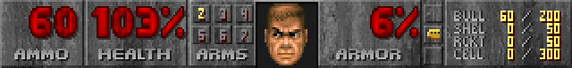

<!-- .slide: class="titleslide" -->

# Data Visualization

## Jill P. Naiman
## Spring 2020

---

## Land Acknowledgment

Please see the Land Acknowledgment in the Syllabus.

[More information can be found on the Chancellor's
Website.](https://chancellor.illinois.edu/land_acknowledgement.html)

---

<!-- .slide: class="vertical_center" -->
## Basics

9AM-11:50PM Mondays

Jill P. Naiman - `jnaiman@illinois.edu`
 * Office Hours: Tuesday 3-4pm NCSA 2040 (this OH can go a little longer as needed), Friday 3-4pm in iSchool lounge; other times by request

TA: Diptendra Bagchi, `dbagchi2@illinois.edu`
 * Office Hours: iSchool, Room 56, Wednesday & Friday 1-2pm

TA: Qiuyan Guo, `qqguo2@illinois.edu`
 * Office Hours: iSchool, Room 56, Thursday 8-9am

https://uiuc-ischool-dataviz.github.io/spring2020/

notes: go through website!!

---

## In summary: where things will be located:

 * Moodle - where the grades and assignments will be posted

 * Course webpage: https://uiuc-ischool-dataviz.github.io/spring2020/ - where lecture slides, notebooks, data & general course info will live.

 * Slack: https://is590dv-spring2020.slack.com/ - the best place to ask questions

---

notes: here is where the iSchool is, NCSA is above

---

## Questions:

* Who are you?
* What are we doing?
* How are we going to do it?

---

## Questions:

* Who are you?
* What are we doing?
* How are we going to do it?

---

### My background

<!---->

---

### My background

---

### My background

---

### My background

---

### My background
#### ytini.com

Naiman et al. 2017, Borkiewicz et al. 2018

---

### My background
#### ytini.com

Naiman et al. 2017, Borkiewicz et al. 2018

---

### My background
#### ytini.com

Naiman et al. 2017, Borkiewicz et al. 2018

---

### My background
#### ytini.com

Naiman et al. 2017, Borkiewicz et al. 2018

---

## Timed activity! (~2 minutes)

On a piece of paper or in notes on your computer:

* What are the most memorable movies you saw over the last year?
* Do you prefer cats or dogs?
* How would you quantify your experience in visualization?
* How many hours do you spend online in classes each week?

notes:
We're going to use these pieces of data to explore how we might approach
visualization.  Each of these items is a different *type* of data --
qualitative, quantitative, elements drawn from sets, and sets of numerical
data.

Trying to visualize each one will give us a basic idea of how we might think
about these types of data, and how we approach visualizing them.

---

Break into groups based on your numbers, and visualize the results by whatever
method you choose: by hand, by computer, or otherwise.

Affix to or inscribe upon your sheet of paper.

notes:
Count off numbers!

Don't get used to sitting in the same seat in this room!  We're going to move
around and try things, starting with hand-crafting some visualizations.

What was easy/hard about visualizing the various datasets?  How did you do it?

---

Break into groups based on your numbers, and visualize the results by whatever
method you choose: by hand, by computer, or otherwise.

Affix to or inscribe upon your sheet of paper.

What did you come up with?

What was easy/hard about visualizing each dataset in a different way?

notes:
Count off numbers!

Don't get used to sitting in the same seat in this room!  We're going to move
around and try things, starting with hand-crafting some visualizations.

What was easy/hard about visualizing the various datasets?  How did you do it?

---

 
 
 

# Bureaucracy

We have to do it!

---

## Getting Python Setup

 1. Download Anaconda!
 
[anaconda.com/download](anaconda.com/download)

 2. Install Week 1 libraries

see: https://uiuc-ischool-dataviz.github.io/spring2020/week01/test_imports_week01.ipynb

---

## Syllabus

 * Week 1 (Today): Introduction, syllabus, examples, and some basics
 * Week 2: Data storage & Operations 
 * Week 3: Types of Viz and color, colormaps
 * Week 4: Distributions, Engines
 * Week 5: Beginning Interactivity
 * Week 6: Interactivity, continued & Grammar of Graphics
 * Week 7: Dashboards & Maps

notes:
This is a rough syllabus!  These are many of the topics we will cover, but
based on how the course proceeds and how folks respond, we may shorten or
lengthen different topics.

The organization here is designed to start out slow, dealing with how to
program python for visualization, understanding how data is laid out, which
operations we can apply to that data, and then moving on to representing data
in different ways.

We might start getting into javascript earlier, depending on how we are doing.

---

## Syllabus, cont

 * Week 8: Comparisons between different datasets
 * Week 9: Maps & Geographic Data 
 * Week 10: Network Visualization & beginning web dev & Publishing, Javascript
 * Week 11: Designing for the web with Python & Javascript, Web dev
 * Week 12: More javascript
 * Week 13: Scientific visualization & Advanced topics
 * Week 14: Group presentations

notes:
Toward the end of class we are going to have a slightly more free-form set of
discussion points.  Your final projects will be somewhat open-ended, requiring
more group work and collaboration than the preceding assignments.

---

## Syllabus: In summary

 * Weeks 1-5: Basics of visualization (Python)
 * Weeks 6-10: Interactivity and Viz Types (Python and Javascript)
 * Weeks 11-15: Platforms and dimensionality (Python, Javascript, Web-dev methods)

notes:
basically, we'll start with the basics - I'm assuming you are coming in with Python experience

---

# Class Mission

While you are already a _consumer_ of visualizations, your
perspective should change to that of a _producer_ of visualizations.
You should be comfortable reading AND writing imagery.

notes:
We will be discussing this as the semester goes on, but the principal outcome I
want you to take away from this class is understanding how to transform data
into its visual representation, and to take that understanding with you as you
observe visualizations presented to you.

By developing visualizations, you will grow to understand the choices that
influence those visualizations, and you will bring that with you while
consuming information visually.

---

# The Things I Want You To Take Away

 * You should know the basics of how to manipulate data -- aggregations,
   filterings, and other operations.
 * I want you to know _some_ of the packages that are out there to visualize
   data.  These will mostly be Python-based, with a couple in Javascript.
 * You won't learn how to use dashboarding software (e.g. Tableau) in detail. Instead, we
   will focus on the different operations that go into dashboarding software.
 * By the end of the course, you will have had the opportunity to look at and
   build visualizations in several different domains and understand how to
   interpret, critique and improve them.

notes:
This course *will* teach you some things about how to code, how to build
visualizations, but we're going to focus much more on learning about how to
construct visualizations and why we make the choices that we do.  If we choose
one way to present data, does that convey information more readily?  Or does it
get in the way of the underlying meaning?

---

## Overview - Themes and Goals

1. What are the components of an effective visualization of quantitative data?
1. What tools and ecosystems are available for visualizing data?
1. What systems can be put in place to generate visualizations rapidly and with high-fidelity representation?

---

## Structure of Class

 * Topic introduction and lecture (~60 minutes)
 * Hands-on, collaborative coding
 * Wrap-up

(Today will be a little lecture heavy)

notes:
This structure will likely be deviated from during the course, but in general
we will start with lecture, take a break, then continue with collaborative or
hands-on exercises using group coding.

During the group coding, I might lead the class in some visualization in
Python, Javascript, or something else.  During this section, I expect that
students will *follow along* with what is going on -- typing in the specific
commands, and maybe even trying different things as we go.  It is not meant to
simply be a "performance" of coding, but instead an opportunity to learn.

---

## Grading

 * 40% Standard assignments in prose or code form
 * 30% Weekly visualization reports
 * 30% Final project

notes:
Your weekly assignments will take different forms.  The first assignment will
be exclusively prose and hand-writing, but subsequent assignments will be
either notebook (coding) based or prose-based as well.

The final project will be described later in class, but will take the form of a
group project that touches on coding as well as visual design.

---

## Weekly Visualization Reports

Every week, you are to turn in a visualization you have found in the media
(newspapers, magazines, online journalism) and a brief summary of something you like/don't like,
think is interesting, etc.

_These are meant to be easy points:_ No more than 2-3 sentences are needed in your description.

Each week, one of you will at random be asked to describe the visualization you picked to the class.

---

## Assignments (not necessarily weekly)

 * Weekly-ish, assigned in class, collected following class
 * Prose assignments: deconstruction or analysis of a visualization or a dataset.
 * Coding assignments: Jupyter/JSMD/etc notebooks following step by step
   through collection and processing of data and the visualization of that
   data

---

## _Optional_ reading assignments

See the course syllabus: https://uiuc-ischool-dataviz.github.io/spring2020/syllabus.html

notes:
These are TOTally optional - more on that in a minute.

---

## Plagiarism

 * Plagiarism is about copying ideas.
 * Cite all code you utilize from elsewhere.

notes:
When programming, I expect that you will do things like search on the internet
to find help with a given problem.  This is fine.

But, you *must* cite where any code snippets came from.  And you *must* note if
you are working with other people in the group!

Using snippets of code is fine -- but you may not copy large-scale amounts of
code from other work (for example, other visualizations) and pass it off as
your own.  Always cite, and be reasonable in what you utilize.

---

## Our tools

 * Python, with some Javascript along the way
 * Jupyter and Jupyter notebooks 
 * The occasional usage of a shell such as bash
 * Once in a while some git, and GitHub
 * Slack

notes:
You will be expected to write code in Python, and to learn the very basics of
Javascript.  Your projects may be turned in via git.  We will also utilize
Slack for class communication.

---

## Viz Systems We Will Cover

In approximate order:

 * [matplotlib](https://matplotlib.org)
 * [bqplot](https://bqplot.readthedocs.io)
 * [vega-lite](https://vega.github.io/vega-lite)
 * [D3](https://d3js.org/)

There'll be a few more along the way.

notes:
This class is not meant to teach you a given tool, but instead a way of
thinking about using visualization tools.  These tools are chosen because of
what they represent, not because they are the only paths to success.

---

## Tools We Will Use

 * [Jupyter](https://jupyter.org/)
 * [GitHub](https://github.com/)
 * [Iodide](https://iodide.io/) and/or [Idyll](https://idyll-lang.org/)

A few others we may get to:
 * [Observable](https://observablehq.com/)
 * [Glitch](https://glitch.com/)
 * [Colaboratory](https://colab.research.google.com/)

notes:
These tools represent many different ways to explore and visualize data.  We'll
use a mix of local installations & web-services.

---

## Slack

We will be sharing a slack channel with the in-person class, so feel free to
converse with them as well!

 * Team channel at `https://is590dv-spring2020.slack.com`
   * `#general` : General announcements
   * `#data-viz` : Help with assignments, general viz questions, Python, Javascript, etc
   * `#random` : see a cool viz you want to share?  This is the place!

---

## Slack (cont)

 * Use the `@` sign appropriately: `@[person]`, `@here`, `@channel`
 * Web client, standalone client and mobile devices can access this team.
 * At the end of the semester, the team will be discontinued.
 * Please think carefully before direct messaging if you could ask in a public
   forum instead.
 * Conduct will be held to same standards as any educational venue.

As always, you can also post questions to the Moodle forum as well.

notes:
Please use slack as much as you need!  You can use it to share items and
articles with the class, to collaborate, to discuss and ask questions and get
feedback.  However, please do behave in a professional fashion.

---

## How do I access Slack?

 * Should have received email
 * Ask me after class or send me an email with _your_ email

---

## Github

 * Course repo is at [UIUC-iSchool-DataViz/spring2020](https://github.com/UIUC-iSchool-DataViz/spring2020/)
 * Automatically built to [uiuc-ischool-dataviz.github.io/spring2020/](https://uiuc-ischool-dataviz.github.io/spring2020/)
 * Copy the notebooks to your directory before using them.
 * Supplemental materials can be found at [UIUC-iSchool-DataViz/support-files](https://github.com/UIUC-iSchool-DataViz/support-files)

notes:
All the materials for this course will be stored in github, and are available
under a very permissive license.  It is largely written in markdown and
automatically compiled to web pages when changes are made.

You are invited to clone the repo, fork and submit changes (typos, etc!), and
to use any information in it in the future.

---

## Choose your own adventure

There are 3 pathways (that I can see in this course, could be more!)

 1. "I am here to get better at programming and play with viz platforms"
 1. "I am thinking about a career in data viz."
 1. "I don't know/I am new to programming and I want to focus on that."

---

## Choose your own adventure

There are 3 pathways (that I can see in this course, could be more!)

 1. "I am here to get better at programming and play with viz platforms"
    * Strategy:
       * look at the code and the extended examples
       * do the Javascript parts

---

## Choose your own adventure

There are 3 pathways (that I can see in this course, could be more!)

 2. "I am thinking about a career in data viz."
    * Strategy: 
       * look at the code
       * do the Javascript parts
       * read the optional texts/docs 

---

## Choose your own adventure

There are 3 pathways (that I can see in this course, could be more!)

 3. "I don't know/I am new to programming and I want to focus on that."
    * Strategy: 
       * look at the code, focus heavily on Python
       * read the prep notebooks before class!
       * do the Javascript parts
       * if you're new to programming, do Javascript parts in class, and build on them for any HW
       * come back to the optional texts/docs after the course is over

---

 
 
 

# We are done with bureaucracy!

---

 
 
 

# On to Viz topics!

---

### Why any data viz course will feel a little weird

notes:
there is a *huge* overlay of topics that cover data viz - from the neurology of how your prefrontal cortex process information, to how humans process storytelling, to data analytics, and color theory and the list goes on!

---

## This week

 * What is a visualization?
 * Why do we visualize?
 * What types of data do we visualize?
 * How do we visualize?

notes:
We're going to start out at a very high-level, discussing why we choose to
visualize versus other types of representation, what types of data, and how we
might do it.

---

## What is a visualization anyway?

"Computer-based *visualization* systems provide visual representations of datasets designed to help people carry out tasks more effectively."

   * Visualization Analysis & Design, Tamara Munzner

notes:
I really like this definition because it gives us a sense of purpose - i.e. that our visualization must help a human with a task that has to do with data.

---

## What is a visualization anyway?

"Computer-based *visualization* systems provide visual representations of datasets designed to help people carry out tasks more effectively."

   * Visualization Analysis & Design, Tamara Munzner

Data Viz is task oriented:

notes:
here for example, we might want to know the labels of bones or how they fit together

---

## What is a visualization anyway?

"Computer-based *visualization* systems provide visual representations of datasets designed to help people carry out tasks more effectively."

   * Visualization Analysis & Design, Tamara Munzner

... versus artistic representations used to convey emotions:

---

## What is a visualization anyway?

"Computer-based *visualization* systems provide visual representations of datasets designed to help people carry out tasks more effectively."

   * Visualization Analysis & Design, Tamara Munzner

... versus movies, comics, or other cinematic representations used to tell stories:

---

# Why?

(Or rather, why _wouldn't_ we visualize?)

notes:
Not everything suits itself to visualization -- and part of the reason for that
is the necessary reductionism that visualization can require.

---

# We can't visualize everything

Peg + Cat:
https://www.youtube.com/embed/In72QAQJ1tY?rel=0

notes:
"There are lots of thing you can compare on a graph / Like who is the shortest
or the tallest giraffe / You can chart how much you walk / How much that you
laugh / There are lots of things you can compare on a graph"

"But the one thing you can't chart / Is how you feel in your heart"

---

# We can't visualize everything

Peg + Cat:
https://www.youtube.com/embed/In72QAQJ1tY?rel=0

"There are lots of thing you can compare on a graph / Like who is the shortest
or the tallest giraffe..."

notes:
"There are lots of thing you can compare on a graph / Like who is the shortest
or the tallest giraffe / You can chart how much you walk / How much that you
laugh / There are lots of things you can compare on a graph"

"But the one thing you can't chart / Is how you feel in your heart"

---

# We can't visualize everything

Peg + Cat:
https://www.youtube.com/embed/In72QAQJ1tY?rel=0

"But the one thing you can't chart / Is how you feel in your heart"

notes:
"There are lots of thing you can compare on a graph / Like who is the shortest
or the tallest giraffe / You can chart how much you walk / How much that you
laugh / There are lots of things you can compare on a graph"

"But the one thing you can't chart / Is how you feel in your heart"

---

# We can't visualize everything

notes:
for example, here is a haptic, or touch based "visualization" for the blind & visually impaired

---

# We can't visualize everything

notes:
you should check it out, because its a thing we are also not going to cover!

---

<!-- .slide: data-background-image="images/fov.svg" data-background-size="contain" -->

notes:
Visual information is communicated through our eyes, where it is processed.  At
the most basic level, we can see a range of about 210 degrees horizontally with
one or both eyes.  The region that is covered by both ("binocular") is about
114 degrees in extent.

You can only cram so much information into the human eye.

---

By Vanessa Ezekowitz [CC BY-SA 3.0](https://creativecommons.org/licenses/by-sa/3.0), via Wikimedia Commons

notes:
When we think about visual communication of information, we *must* think about
how human physiology interacts with that communication.

Also, fair warning: I'm not a medical doctor.

This diagram shows the visual acuity of a "standard" human eye, as a function
of angular distance from the fovea.  We have to think about this in
*conjunction* with our field of view.

---

# Your brain does interpolation

There are 12 dots, can you count them all at the same time?

---

# Your brain does interpolation

Step 1: Look at the cross

Step 2: Close left eye, keep looking at the cross

Step 3: Slowly move your head toward & away from screen until dot disappears

---

# Your brain does interpolation

Step 1: Look at the cross

Step 2: Close left eye, keep looking at the cross

Step 3: Slowly move your head toward & away from screen until dot disappears

# ... and sometimes it gets it wrong!

---

# Even so, the visual cortex is great for information transfer

Your visual cortex is processing information from different parts of this page AT THE SAME TIME which means it can do impressive things very quickly.

---

Can you spot the differences?

notes:
compare this to how long it would take to spot differences in 2 songs - you'd have to listen to both songs (probably more than once) and compare after!  This would be sequential rather than parallel data transfer!

---

# Visualization augments human data analysis capabilities

 * enhances our ability to pattern find
 * allows us to summarize data quickly
 * allows us to search our data quickly

---

## An example: I need a volunteer!

notes:
(This part is a bit of a stunt.  Sorry.)

---

*Read these numbers:*

| | |
|:-|-:|
| 2007-01-01 | 14233.2 |
| 2007-04-01 | 14422.3 |
| 2007-07-01 | 14569.7 |
| 2007-10-01 | 14685.3 |
| 2008-01-01 | 14668.4 |
| 2008-04-01 | 14813.0 |
| 2008-07-01 | 14843.0 |
| 2008-10-01 | 14549.9 |
| 2009-01-01 | 14383.9 |

notes:
See what I mean?  It's a stunt.  You're supposed to hear these, or look at the
numbers, and not have as clear an impression.  It also takes a lot longer.

---

notes:
You might immediately notice a few things about this image, but one item that
we will talk about as class goes on is that often visualizations can have a
consistent style.  FRED in particular has a "branding" that is quite obvious,
even without the logo.

Also, the data we read was in the last sort of gray area of this graph.

---

## Anscombe's Quartet

This famous example show's 4 datasets with the exact same mean, varience and correlation coefficient.

Statistics can be useful, but visualization generated context!

---

## Same thing but with a dinosaur

Statistics can be useful, but visualization generated context!

---

 
 
 

# A few final considerations.

---

# Who are you visualizing for?

* For yourself?
* For a peer?
* For someone else?

notes:
*Whenever* you build a visualization you need to think about the context that
you can assume on the part of your viewer.

We will talk about how your viz changes with audience in this course.

---

# Tenet 1:

"Visualizing data" is not a strict subset of "making an image."

 * Collection of the data
 * Organization of that data
 * Representation of that data

notes:
We will approach visualization as encompassing several different stages in the
collection, organization and representation of data.

---

# Tenet 2:

We tell lies to visualize, but we _must_ be honest.

 * No representation is going to convey the entire complexity of a dataset.
 * Some representations are better than others.

---

### "The Principle of Proportional Ink" - callingbullshit.org

notes:
So let's first talk about how misleading visualizations can be. This 3D pie chart violates the "principle of proportional ink" which states that the number of pixels that represent a value should be proportional to the value. With the raised edge on the pie chart, the blue wedge gets way more ink than it deserves and you get a disproportionate sense of value.

---

### "Spurious Correlations" - tylervigen.com

notes:
you can have a lot of absurd fun with data - but when data is presented in a visualization, people often believe the authority of it even if it's outlandish. 

This guy has some good ideas of where to find sample datasets for upcoming homework assignments too!

---

<!-- .slide: data-background-image="images/barCharts.png" data-background-size="contain" -->

notes:
Each of these bar chart examples are meant to show the same data. But you can see how they're a bit problematic.

---

<!-- .slide: data-background-image="images/gunDeaths.jpg" data-background-size="contain" -->

notes:
Now here's an example that's more brazen. I'll give you a minute to analyze this and tell me what's wrong with this graph.

Some people will claim the Y-axis should always start from the bottom - at zero - to avoid confusion.

---

<!-- .slide: data-background-image="images/keelingCurve.svg" data-background-size="contain" -->

notes:
however, the Keeling Curve is an interesting counter-argument. This is the famous graph that was the original evidence for global warming, showing the rate at which atmospheric carbon dioxide was growing. 

Does anyone know why it's generally accepted to show the y-axis like this, without it starting at the zero axis?

---

<!-- .slide: data-background-image="images/hearts_battery.svg" data-background-size="contain" -->

notes:
here are a few more representations of data that you've probably run into!

---

<!-- .slide: data-background-image="images/battery.svg" data-background-size="contain" -->

 1. Sensors read the current "fill" of the battery
    * Analog / digital conversion
    * Normalized with respect to expected "full"
 1. This is then scaled to a percentage
 1. The battery image is filled from left to right
 1. The image is then rasterized and displayed

notes: what goes into this representation

---

<!-- .slide: data-background-image="images/hearts_bw.svg" data-background-size="contain" -->

 * Some fixed maximum amount of damage
 * Each time damage is taken, decrement
 * Each time damage is reversed, increment
 * Display number of hearts as appropriate

---

2 out of 3 "points"

<!-- .slide: data-background-image="images/hearts_color.svg" data-background-size="contain" -->

---

<!-- .slide: data-background-image="images/hearts_color.svg" data-background-size="contain" -->

---

<!-- .slide: data-background-image="images/stitch_bg.png" data-background-size="contain"-->

notes:
This is a screenshot from the movie "Lilo and Stitch" where the little girl Lilo is graphing how much evil is in the alien Stitch. It borrows from a familiar visual - the thermometer. But how could this visualization be misinterpreted? How is it different from a thermometer?

---

<!-- .slide: data-background-image="images/stitch_nobg.png" data-background-size="contain"-->

notes:
The angle can be misleading. So can the relative width of the head vs the feet. The surface area is not consistent from top to bottom. Also there are empty areas in the mouth and eyes!

---

<!-- .slide: data-background-image="images/stitch_nobg_tilted.png" data-background-size="contain"-->

notes:
If we rotate the image so that the red liquid is level, do we get a different impression for how much bad is in Stitch?

---

<iframe width="1024" height="576"
src="https://www.youtube.com/embed/D-uBv6jB7r0?rel=0" frameborder="0"
allow="autoplay; encrypted-media" allowfullscreen></iframe>

notes:
How could this visualization be misleading? What about the camera move? What about the colors used? Are there actually several distinct layers of shells or is this a continuous volume?

---

## Honesty

Our choices must be:

 * Deliberate
 * Informed
 * Motivated
 * Justifiable

---

## Election Maps

Mark Newman of the University of Michigan has created visualizations of the
election maps from several of the most recent elections.  For more information
and context, see his page http://www-personal.umich.edu/~mejn/election/2008/ .

 * [Map 1](http://www-personal.umich.edu/~mejn/election/2008/statemapredbluer1024.png)
 * [Map 2](http://www-personal.umich.edu/~mejn/election/2008/statepopredblue1024.png)
 * [Map 3](http://www-personal.umich.edu/~mejn/election/2008/countymapredbluer1024.png)
 * [Map 4](http://www-personal.umich.edu/~mejn/election/2008/countymappurpler1024.png)
 * [Map 5](http://www-personal.umich.edu/~mejn/election/2008/countycartpurple1024.png)

notes:
These are great, but some criticisms might be that the color red is more apparent to the human eye than the color blue. And in the population-to-area adjusted maps, it's difficult to read for people used to geographic accuracy.

Map1 - this is just a geographical map of red and blue

Map2 - cartogram weighted by population (note, NOT by electoral college population)

Map3 - election results by county

Map4 - percentage of votes by county

Map5 - percentage of votes by county, weighted by population

---

## Getting started in Python

*Open up Python & get started coding!*

---

## This week: Wrap-up

 1. We visualize to change how we understand things.
 1. We visualize data for ourselves, for our peers, and for others.
 1. Visualization is a series of steps that we take to produce a different
    representation of data.

---

## Assignment 1

 * Identify three visualizations in pop culture -- *not* academic literature.
   This could be, for instance, from:
   * Movies / TV / Music videos
   * Everyday life
   * Advertisements
 * Describe each one in detail
   * Where did the data come from?
   * Is the data quantitative, qualitative, categorical, etc?
   * How was the data processed before being displayed?
   * What method was used to display that data?
 * Replicate the visualization with different, but similarly “shaped,” data
   * By hand is acceptable
   * Computational methods should include source code

PLUS: an intake survey -  https://forms.gle/daHMr8n8Vd97rUCv8

<small>Example: https://uiuc-ischool-dataviz.github.io/spring2020/week01/example_assignment.html</small>

---

## Assignment 1

 * Identify three visualizations in pop culture -- *not* academic literature.
   This could be, for instance, from:
   * Movies / TV / Music videos
   * Everyday life
   * Advertisements
 * Describe each one in detail
   * Where did the data come from?
   * Is the data quantitative, qualitative, categorical, etc?
   * How was the data processed before being displayed?
   * What method was used to display that data?
 * Replicate the visualization with different, but similarly “shaped,” data
   * By hand is acceptable
   * Computational methods should include source code

PLUS: an intake survey -  https://forms.gle/daHMr8n8Vd97rUCv8

<small>Example: https://uiuc-ischool-dataviz.github.io/spring2020/week01/example_assignment.html</small>

---
