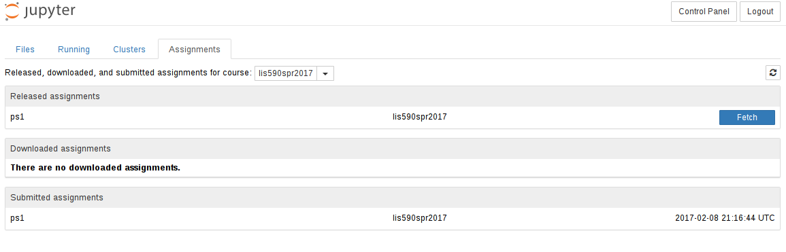

<!-- .slide: class="titleslide" -->

# Data Visualization

<div style="height: 6.0em;"></div>

## Jill P. Naiman
## Fall 2020

---

## Land Acknowledgment

Please see the Land Acknowledgment in the Syllabus.

[More information can be found on the Chancellor's
Website.](https://chancellor.illinois.edu/land_acknowledgement.html)

---
<!-- .slide: class="vertical_center" -->
## Basics

9AM-11:50PM Wednesdays, TBD

Jill P. Naiman - `jnaiman@illinois.edu`
Office Hours: TBD

TA TBD `TBD@illinois.edu`

https://uiuc-ischool-dataviz.github.io/spring2020/

---

## Timed activity!

On a piece of paper:

* What are the most memorable movies you saw over the last year?
* Do you prefer cats or dogs?
* How would you quantify your experience in visualization?
* How many people are in each row in this classroom?

notes:
We're going to use these pieces of data to explore how we might approach
visualization.  Each of these items is a different *type* of data --
qualitative, quantitative, elements drawn from sets, and sets of numerical
data.

Trying to visualize each one will give us a basic idea of how we might think
about these types of data, and how we approach visualizing them.

---

Break into groups based on your numbers, and visualize the results by whatever
method you choose: by hand, by computer, or otherwise.

Affix to or inscribe upon your sheet of paper.

notes:
Don't get used to sitting in the same seat in this room!  We're going to move
around and try things, starting with hand-crafting some visualizations.

---

## Intake Survey

[forms.gle/ayFAcBrP9yt9rgCA6](https://forms.gle/ayFAcBrP9yt9rgCA6)

---

## Viz Systems We Will Cover

 * [vega-lite](https://vega.github.io/vega-lite)
 * [D3](https://d3js.org/)
 * [bqplot](https://bqplot.readthedocs.io)
 * [matplotlib](https://matplotlib.org)

There'll be a few more along the way.

notes:
This class is not meant to teach you a given tool, but instead a way of
thinking about using visualization tools.  These tools are chosen because of
what they represent, not because they are the only paths to success.

---

## Tools We Will Use

 * [GitHub](https://github.com/)
 * [Iodide](https://iodide.io/)
 * [Observable](https://observablehq.com/)
 * [Jupyter](https://jupyter.org/)
 * [Glitch](https://glitch.com/)
 * [Colaboratory](https://colab.research.google.com/)

notes:
These tools represent many different ways to explore and visualize data.  We'll
emphasize using services, rather than local installations.

---


## Syllabus

 * Weeks 1-5: Basics of visualization
 * Weeks 6-10: Interactivity and Viz Types
 * Weeks 11-15: Platforms and dimensionality

notes:
This is a rough syllabus!  These are many of the topics we will cover, but
based on how the course proceeds and how folks respond, we may shorten or
lengthen different topics.

The organization here is designed to start out slow, dealing with how to
program python and javascript for visualization, understanding how data is laid
out, which operations we can apply to that data, and then moving on to
representing data in different ways.

---

## Weeks 1-5

 * How are files laid out?
 * What is in our operational palette?
 * Basics of using Javascript, Python, and writing JSON
 * Basic quantitative visualizations

---

## Weeks 6-10

 * Distributions of values in different dimensions
 * Simple interactivity 
 * Reactive programming
 * Colors, images
 * Comparisons across datasets

---

## Weeks 11-15

 * Scientific Visualization
 * Alternative visualization platforms
 * Dashboarding
 * Group projects

notes:
Toward the end of class we are going to have a slightly more free-form set of
discussion points.  Your final projects will be somewhat open-ended, requiring
more group work and collaboration than the preceding assignments.

---

# Class Mission

Your role as a _consumer_ of visualizations should change to also include the
perspective of a _producer_ of visualizations.

notes:
We will be discussing this as the semester goes on, but the principal outcome I
want you to take away from this class is understanding how to transform data
into its visual representation, and to take that understanding with you as you
observe visualizations presented to you.

By developing visualizations, you will grow to understand the choices that
influence those visualizations, and you will bring that with you while
consuming information visually.

---

# The Things I Want You To Take Away

 * You should know the basics of how to manipulate data -- aggregations,
   filterings, and other operations.
 * I want you to know _some_ of the packages that are out there to visualize
   data.  These will mostly be Python-based, with a couple in Javascript.
 * You won't learn how to use dashboarding software in detail.  Instead, we
   will talk about the different operations that go into dashboarding software.
 * By the end of the course, you will have had the opportunity to look at and
   build visualizations in several different domains and understand how to
   interpret, critique and improve them.

notes:
This course *will* teach you some things about how to code, how to build
visualizations, but we're going to focus much more on learning about how to
construct visualizations and why we make the choices that we do.  If we choose
one way to present data, does that convey information more readily?  Or does it
get in the way of the underlying meaning?

---

## Overview - Themes and Goals

1. What are the components of an effective visualization of quantitative data?
1. What tools and ecosystems are available for visualizing data?
1. What systems can be put in place to generate visualizations rapidly and with high-fidelity representation?

---

## Structure of Class

 * Topic introduction and lecture (60-90 minutes)
 * Hands-on, collaborative coding
 * Wrap-up

You will each be assigned to a group to do collective note-taking.  The day
before class each week, you will be notified that you will be taking notes the
next day and you will be provided the link to a collaborative document.
Following the lecture, your notes will be added to the course website.

notes:
This structure will likely be deviated from during the course, but in general
we will start with lecture, take a break, then continue with collaborative or
hands-on exercises using group coding.

During the group coding, I might lead the class in some visualization in
Python, Javascript, or something else.  During this section, I expect that
students will *follow along* with what is going on -- typing in the specific
commands, and maybe even trying different things as we go.  It is not meant to
simply be a "performance" of coding, but instead an opportunity to learn.

---

## Grading

 * 40% Standard assignments in prose or code form
 * 30% Weekly visualization reports
 * 30% Final project

notes:
Your weekly assignments will take different forms.  The first assignment will
be exclusively prose and hand-writing, but subsequent assignments will be
either notebook (coding) based or prose-based as well.

The final project will be described later in class, but will take the form of a
group project that touches on coding as well as visual design.

---

## Weekly Assignments

Every week, you are to turn in a visualization you have found in the media
(newspapers, magazines, online journalism.)

Each week, one of you will at random be asked to describe the visualization to the class.

---

## Assignments

 * Weekly, assigned in class, collected following class
 * Prose assignments: deconstruction or analysis of a visualization or a dataset.
 * Coding assignments: Jupyter/JSMD/etc notebooks following step by step
   through collection and processing of data and the visualization of that
   data

---

## Plagiarism

 * Plagiarism is about copying ideas.
 * Cite all code you utilize from elsewhere.

notes:
When programming, I expect that you will do things like search on the internet
to find help with a given problem.  This is fine.

But, you *must* cite where any code snippets came from.  And you *must* note if
you are working with other people in the group!

Using snippets of code is fine -- but you may not copy large-scale amounts of
code from other work (for example, other visualizations) and pass it off as
your own.  Always cite, and be reasonable in what you utilize.

---

## Our tools

 * Python, with some R and Javascript along the way
 * Jupyter and Jupyter notebooks on a Jupyterhub, with nbgrader
 * The occasional usage of a shell such as bash
 * Once in a while some git, and GitHub
 * Slack

notes:
You will be expected to write code in Python, and to learn the very basics of
Javascript.  Your projects may be turned in via git.  We will also utilize
Slack for class communication.

---


notes:
Jupyterhub is a software system for launching multiple independent notebooks
that can share access to data and installed software.  Ours is administered by
the iSchool.

---

## Jupyterhub Guidelines

 * [jupyterhub.ischool.illinois.edu](https://jupyterhub.ischool.illinois.edu/)
 * Please store your notebooks on- and off-site
 * Submissions will be via `nbgrader`
 * Data will be available at `/home/shared/fall19-is590dv/data/`
 * Previous lectures will be in `/home/shared/fall19-is590dv/fall2019/`
 * You will have access to conda, etc, but I may rebuild images to add packages.

notes:
It is possible that your JupyterHub instance may be lost -- don't store mission
critical data there without a backup.  It should be possible to share data
between people on the system, but I won't pretend to know the right way to do
that.

---

## Assignment Flow



 1. Instructor "releases" an assignment
 1. Assignment appears in student "Assignments" tab
 1. Students "fetch" assignment, which copies it to their work directory
 1. When done, students "submit" assignment, which copies it to the
    instructor’s inbox
 1. Grades and feedback will be posted on Moodle.

notes:
We will be using `nbgrader` for notebook grading.  This will in general allow
you the opportunity to see *most* of the results of your grade prior to
submission.

---

## Slack

 * Team is at `is590dv-fall2019.slack.com`
   * `#general` : General announcements
   * `#classwork` : Help with assignments
   * `#help` : General help with Python, Javascript, visualization, etc
   * `#lectures` : During lectures, post links, comments, questions here
 * Use the `@` sign appropriately: `@[person]`, `@here`, `@channel`
 * Web client, standalone client and mobile devices can access this team.
 * At the end of the semester, the team will be discontinued.
 * Please think carefully before direct messaging if you could ask in a public
   forum instead.
 * Conduct will be held to same standards as any educational venue.

notes:
Please use slack as much as you need!  You can use it to share items and
articles with the class, to collaborate, to discuss and ask questions and get
feedback.  However, please do behave in a professional fashion.

---

## Github

 * Course repo is at [UIUC-iSchool-DataViz/fall2019](https://github.com/UIUC-iSchool-DataViz/fall2019/)
 * Automatically built to [uiuc-ischool-dataviz.github.io/fall2019/](https://uiuc-ischool-dataviz.github.io/fall2019/)
 * Lecture notes will be placed there, and available in your JupyterHub
   instances in `shared/fall19-is590dv/fall2019`
 * Copy the notebooks to your directory before using them.
 * Supplemental materials can be found at [UIUC-iSchool-DataViz/support-files](https://github.com/UIUC-iSchool-DataViz/support-files)

notes:
All the materials for this course will be stored in github, and are available
under a very permissive license.  It is largely written in markdown and
automatically compiled to web pages when changes are made.

You are invited to clone the repo, fork and submit changes (typos, etc!), and
to use any information in it in the future.

---

## This week

 * Why do we visualize?
 * What types of data do we visualize?
 * How do we visualize?

notes:
We're going to start out at a very high-level, discussing why we choose to
visualize versus other types of representation, what types of data, and how we
might do it.

---

# Why?

(Or rather, why _wouldn't_ we visualize?)

notes:
Not everything suits itself to visualization -- and part of the reason for that
is the necessary reductionism that visualization can require.

---

<iframe width="1024" height="576"
src="https://www.youtube.com/embed/In72QAQJ1tY?rel=0" frameborder="0"
allow="encrypted-media" allowfullscreen></iframe>

notes:
"There are lots of thing you can compare on a graph / Like who is the shortest
or the tallest giraffe / You can chart how much you walk / How much that you
laugh / There are lots of things you can compare on a graph"

"But the one thing you can't chart / Is how you feel in your heart"

---

<!-- .slide: data-background-image="images/fov.svg" data-background-size="contain" -->

notes:
Visual information is communicated through our eyes, where it is processed.  At
the most basic level, we can see a range of about 210 degrees horizontally with
one or both eyes.  The region that is covered by both ("binocular") is about
114 degrees in extent.

You can only cram so much information into the human eye.

---


By Vanessa Ezekowitz [CC BY-SA 3.0](https://creativecommons.org/licenses/by-sa/3.0), via Wikimedia Commons

notes:
When we think about visual communication of information, we *must* think about
how human physiology interacts with that communication.

Also, fair warning: I'm not a medical doctor.

This diagram shows the visual acuity of a "standard" human eye, as a function
of angular distance from the fovea.  We have to think about this in
*conjunction* with our field of view.

---

## I need a volunteer!

notes:
(This part is a bit of a stunt.  Sorry.)

---

*Read these numbers:*

| | |
|:-|-:|
| 2007-01-01 | 14233.2 |
| 2007-04-01 | 14422.3 |
| 2007-07-01 | 14569.7 |
| 2007-10-01 | 14685.3 |
| 2008-01-01 | 14668.4 |
| 2008-04-01 | 14813.0 |
| 2008-07-01 | 14843.0 |
| 2008-10-01 | 14549.9 |
| 2009-01-01 | 14383.9 |

notes:
See what I mean?  It's a stunt.  You're supposed to hear these, or look at the
numbers, and not have as clear an impression.  It also takes a lot longer.

---


notes:
You might immediately notice a few things about this image, but one item that
we will talk about as class goes on is that often visualizations can have a
consistent style.  FRED in particular has a "branding" that is quite obvious,
even without the logo.

---

# Who are you visualizing for?

* For yourself?
* For a peer?
* For someone else?

notes:
*Whenever* you build a visualization you need to think about the context that
you can assume on the part of your viewer.

---

# Tenet 1:

"Visualizing data" is not a strict subset of "making an image."

notes:
We will approach visualization as encompassing several different stages in the
collection, organization and representation of data.

---

 * Collection of the data
 * Organization of that data
 * Representation of that data

---

# Tenet 2:

We tell lies to visualize, but we _must_ be honest.

---

<!-- .slide: data-background-image="images/hearts_battery.svg" data-background-size="contain" -->

---

<!-- .slide: data-background-image="images/battery.svg" data-background-size="contain" -->

<div style="height: 10em;"></div>

 1. Sensors read the current "fill" of the battery
    * Analog / digital conversion
    * Normalized with respect to expected "full"
 1. This is then scaled to a percentage
 1. The battery image is filled from left to right
 1. The image is then rasterized and displayed

---

<!-- .slide: data-background-image="images/hearts_bw.svg" data-background-size="contain" -->

 * Some fixed maximum amount of damage
 * Each time damage is taken, decrement
 * Each time damage is reversed, increment
 * Display number of hearts as appropriate

---

2 out of 3 "points"

<!-- .slide: data-background-image="images/hearts_color.svg" data-background-size="contain" -->

---

<!-- .slide: data-background-image="images/hearts_color.svg" data-background-size="contain" -->


---

<!-- .slide: data-background-image="images/stitch_bg.png" data-background-size="contain"-->

---

<!-- .slide: data-background-image="images/stitch_nobg.png" data-background-size="contain"-->

---

<!-- .slide: data-background-image="images/stitch_nobg_tilted.png" data-background-size="contain"-->

---

<iframe width="1024" height="576"
src="https://www.youtube.com/embed/D-uBv6jB7r0" frameborder="0"
allow="autoplay; encrypted-media" allowfullscreen></iframe>

---

## Honesty

Our choices must be:

 * Deliberate
 * Informed
 * Motivated
 * Justifiable

---

## Election Maps

Mark Newman of the University of Michigan has created visualizations of the
election maps from several of the most recent elections.  For more information
and context, see his page http://www-personal.umich.edu/~mejn/election/2008/ .

 * [Map 1](http://www-personal.umich.edu/~mejn/election/2008/statemapredbluer1024.png)
 * [Map 2](http://www-personal.umich.edu/~mejn/election/2008/statepopredblue1024.png)
 * [Map 3](http://www-personal.umich.edu/~mejn/election/2008/countymapredbluer1024.png)
 * [Map 4](http://www-personal.umich.edu/~mejn/election/2008/countymappurpler1024.png)
 * [Map 5](http://www-personal.umich.edu/~mejn/election/2008/countycartpurple1024.png)

---

## This week: Wrap-up

 1. We visualize to change how we understand things.
 1. We visualize data for ourselves, for our peers, and for others.
 1. Visualization is a series of steps that we take to produce a different
    representation of data.

---

## Assignment 1

 * Identify three visualizations in pop culture -- *not* academic literature.
   This could be, for instance, from:
   * Movies / TV / Music videos
   * Everyday life
   * Advertisements
 * Describe each one in detail
   * Where did the data come from?
   * Is the data quantitative, qualitative, categorical, etc?
   * How was the data processed before being displayed?
   * What method was used to display that data?
 * Replicate the visualization with different, but similarly “shaped,” data
   * By hand is acceptable
   * Computational methods should include source code

---

## Let's Get Started with Iodide!

 1. Create a [github](https://github.com/) account if you do not have one
 1. Visit [iodide.io](https://iodide.io/) to log in to iodide.
 1. Create a new notebook

---

## Basics of jsmd

Iodide uses a system called `jsmd` for describing the code and narrative presented.  It intersperses different types of "cells" in a text entry box.

Each cell is delineated by the prefix `%%` and the type of cell.  For instance, this would be a javascript cell followed by a markdown cell:

```
%% js
var a = [1, 2, 3]
%% md
Hi there! *This is markdown*.
```

---

## Types of jsmd cells

These are the types of cells you can use:

 * `js` is Javascript code
 * `py` for python code (more on that later)
 * `md` for Markdown
 * `css` for CSS styles
 * `fetch` to retrieve data, files, or javascript libraries
 * `raw` for raw text, ignored by Iodide

---

## Material to Cover

We'll cover a few basics of Javascript and Python.

 1. Javascript types: strings, arrays, functions, and objects
 1. Python types: arrays, lists, numbers

---

Let's go!
