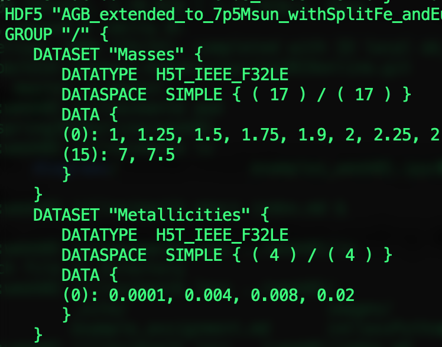
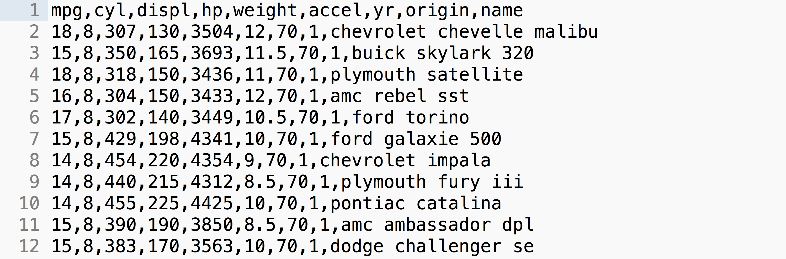
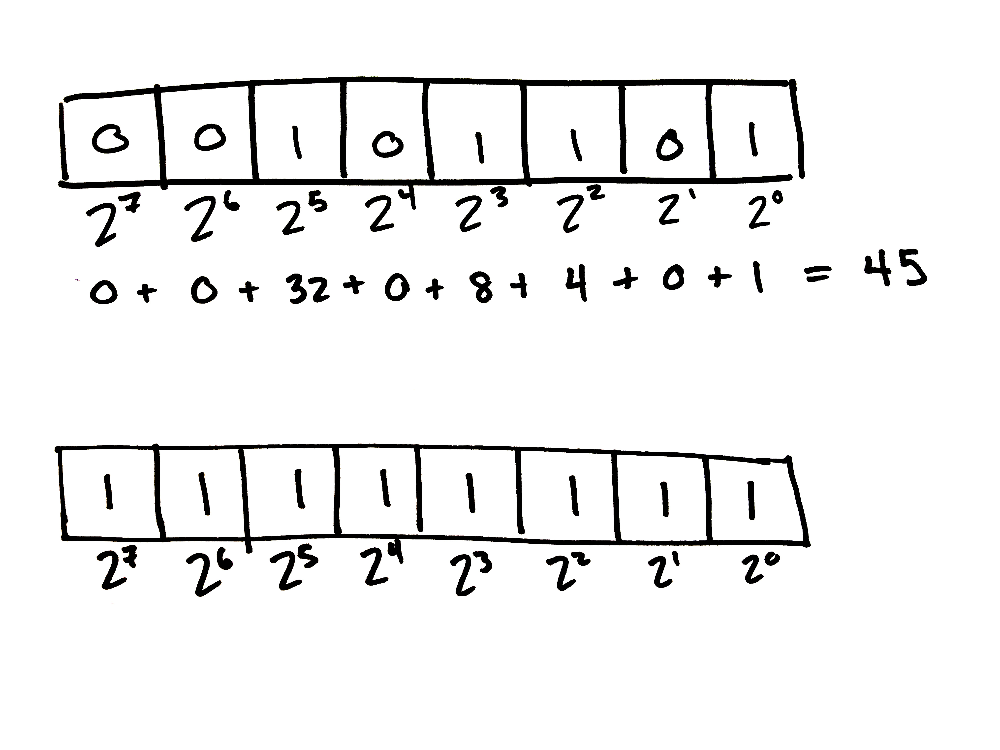
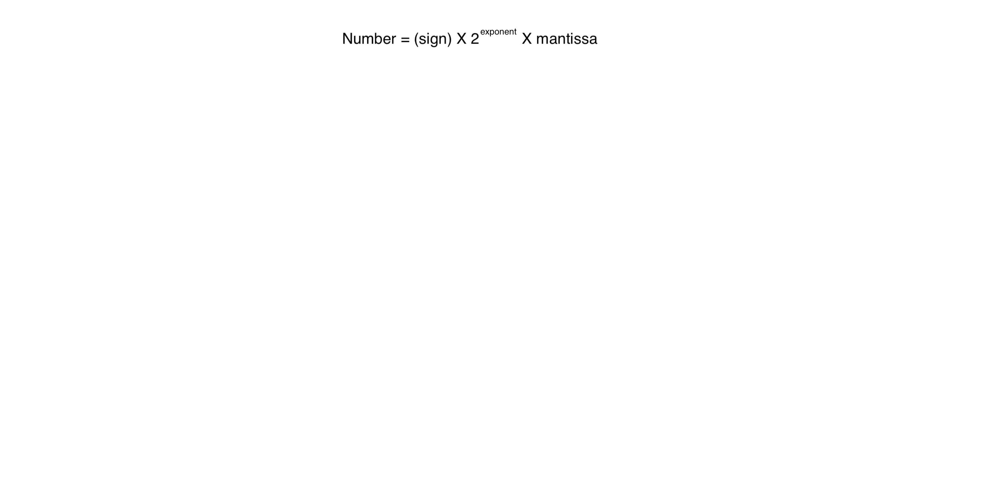
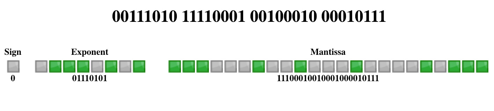
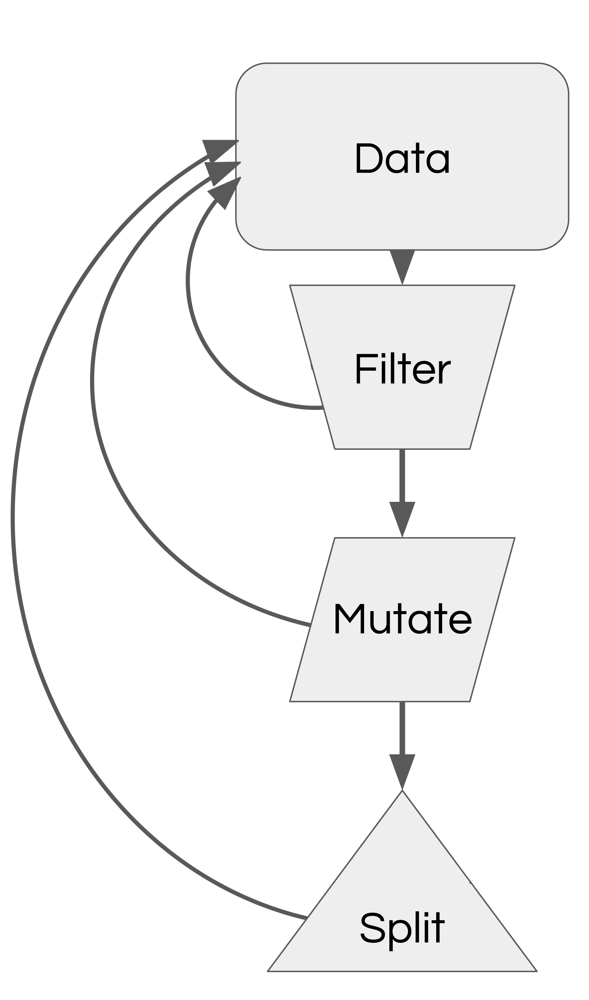

<!-- .slide: class="titleslide" -->

# Data Visualization
<div style="height: 6.0em;"></div>
## Jill P. Naiman
## Spring 2019
## Lecture 2

---
## Brainstorming Warm-Up Activity

1. What is the visualization trying to show?
1. What are its methods?
1. What are the strengths / weaknesses?
1. (Bonus) Where is the outright error?


[Harvey's Energy Toll](https://www.axios.com/the-latest-on-harveys-energy-toll-2479055875.html)

There are no concrete right or wrong answers here!

---

## Today's Topics

 * JupyterHub?  Status.
 * Data Formats
 * Operational Palette
 * Notebook walkthrough & cheat sheets
   * Data structures: lists, dicts, sets
   * Iteration
   * Plotting
   * Numpy and indexing

---

<!-- .slide: data-background-image="images/viz_diagram.svg.png" data-background-size="contain"-->

notes: Today we are going to discuss different sorts of data formats.

---

<!-- .slide: data-background-image="images/viz_diagram2.svg.png" data-background-size="contain"-->

notes: Usually we are going to be
able to make use of readers

---

<!-- .slide: class="two-floating-elements" -->

## Files, Data, and Organization

* Text
  * ASCII (raw)
  * CSV / TSV
  * JSON
* Binary
  * HDF5
  * PNG/BMP/GIF/JPG/etc
  * Excel
  * Arrow
* Query-based
  * SQL
  * JSON/REST

<div class="right" markdown=1>

<!---->


<!---->



</div>

notes:
read-write operations from disk are extremely time consuming, so raw text files come with massive overhead

REST = REpresentational State Transfer - web architecture that keeps clients and servers independent and queries using flexible JSON formatting.

---

## Organization

| | Column 1 | Column 2 | Column 3 | Column 4 |
|-|-|-|-|-|
|Row 1|11|21|31|41|
|Row 2|12|22|32|42|
|Row 3|13|23|33|43|

In computer memory, this data is all stored linearly, with one value immediately following
another. This can affect the speed of data processing.

We can do this in two methods.

---

## Organization

| | Column 1 | Column 2 | Column 3 | Column 4 |
|-|-|-|-|-|
|Row 1|11|21|31|41|
|Row 2|12|22|32|42|
|Row 3|13|23|33|43|

<div style="height: 2.0em;"></div>

### (1) Row

||||||||||
|-|-|-|-|-|-|-|-|-|-|-|
| 11 <!--.element: class="table-hl" -->| <!--.element: class="table-hl" -->21 | 31 | 41 | 12 | 22 | 32 | 42 | 13 | 23 | 33 | 43 |

In row-oriented storage, successive _fields_ (columns) for a single _record_ (rows) are
adjacent.

notes: point out mapping between rows and columns

---

## Organization

| | Column 1 | Column 2 | Column 3 | Column 4 |
|-|-|-|-|-|
|Row 1|11|21|31|41|
|Row 2|12|22|32|42|
|Row 3|13|23|33|43|

<div style="height: 2.0em;"></div>

### (2) Column

||||||||||
|-|-|-|-|-|-|-|-|-|-|-|
| 11 <!--.element: class="table-hl" -->| 12 | 13 | <!-- .element: class="table-hl" --> 21 | 22 | 23 | 31 | 32 | 33 | 41 | 42 | 43 |

In column-oriented storage, successive _records_ (rows) for a single _field_ (columns) are
adjacent.

notes: point out mapping between rows and columns

---

### Organization: Row

||||||||||
|-|-|-|-|-|-|-|-|-|-|-|
| 11 <!--.element: class="table-hl" -->| <!--.element: class="table-hl" -->21 | 31 | 41 | 12 | 22 | 32 | 42 | 13 | 23 | 33 | 43 |

In row-oriented storage, successive _fields_ for a single _record_ are
adjacent.

<div style="height: 2.0em;"></div>

### Organization: Column

||||||||||
|-|-|-|-|-|-|-|-|-|-|-|
| 11 <!--.element: class="table-hl" -->| 12 | 13 | <!-- .element: class="table-hl" --> 21 | 22 | 23 | 31 | 32 | 33 | 41 | 42 | 43 |

In column-oriented storage, successive _records_ for a single _field_ are
adjacent.

notes:
These formats are more efficient when the information you're interested in is adjacent. For instance, operations requiring many rows and only a few columns benefit from row-oriented storage.

---

## CSV (Comma-separated values)

| Column 1 | Column 2 | Column 3 | Column 4 | Column 5 |
|-|-|-|-|-|
| . | . | . | . | . |
| . | . | . | . | . |
| . | . | . | . | . |
| . | . | . | . | . |

<div style="height: 2.0em;"></div>

---

## CSV (Comma-separated values)



 * "Lowest-common denominator format" (widest available)
 * Flexible delimiters 
 * Ad hoc comments and headers (data readers need to be adapted)
 * Row-oriented
 * Row-size can vary: no implicit indexing

notes:
Sometimes called "DSV" or "Delimiter-separated values"

Ad hoc means data readers need to be adapted to format.

---

## Reading CSV

```
...
390,1.83970e-003,-4.53930e-004,1.21520e-002
395,4.61530e-003,-1.04640e-003,3.11100e-002
400,9.62640e-003,-2.16890e-003,6.23710e-002
405,1.89790e-002,-4.43040e-003,1.31610e-001
410,3.08030e-002,-7.20480e-003,2.27500e-001
415,4.24590e-002,-1.25790e-002,3.58970e-001
420,5.16620e-002,-1.66510e-002,5.23960e-001
425,5.28370e-002,-2.12400e-002,6.85860e-001
...
```

notes:
Let's take this sample data and see how it's represented in computer memory.

---

## Binary


notes:
Who can tell me what decimal number these binary digits represent?

---

## Binary


notes:
2 to each exponent is flipped on or off, then the on-values are added together.

---

## Binary



notes:
Who can tell me what these digits represent in decimal?

---

## Binary


notes:
Computers use electrical current to turn millions of switches called "bits" on or off. They combine 8 bits together like this to make a "byte". 

---

```

390,1.83970e-003,-4.53930e-004,1.21520e-002
```

If we assume ASCII encoding, this becomes:

| | | |
|-|-|-|
|"390" <!-- .element: class="table-hl" --> |51 |57 |48 |
<!-- .element: style="margin-left: 0.2em;" -->


notes:
A string is not a number, but a list of characters. A character is a symbol represented by a unique byte as described in the ASCII table.

---

```

390,1.83970e-003,-4.53930e-004,1.21520e-002
```

If we assume ASCII encoding, this becomes:

| | | |
|-|-|-|
|"390" <!-- .element: class="table-hl" --> |51 |57 |48 |
<!-- .element: style="margin-left: 0.2em;" -->

Breaking this further down, we encode each character:

||||||||||
|-|-|-|-|-|-|-|-|-|
|51 <!-- .element: class="table-hl" --> | 0 | 0 | 1 | 1 | 0 | 0 | 1 | 1 |
|57 <!-- .element: class="table-hl" --> | 0 | 0 | 1 | 1 | 1 | 0 | 0 | 1 |
|48 <!-- .element: class="table-hl" --> | 0 | 0 | 1 | 1 | 0 | 0 | 0 | 0 |
<!-- .element: style="margin-left: 0.2em;" -->

---

```

390,1.83970e-003,-4.53930e-004,1.21520e-002
```

Then a string-to-float function translates the string "390" into a floating point number.

For a 32-bit, single-precision floating point number in the computer this looks like:



notes:
This is how our example would be stored as an IEEE754 Single precision 32-bit float. This IEEE standard for encoding floats tries to optimize for very small and very large numbers, with the understanding that computers cannot store infinite accuracy.

---


---


---


---


---


---


---
```

390,1.83970e-003,-4.53930e-004,1.21520e-002
```

|||||||||||||
|-|-|-|-|-|-|-|-|-|-|-|-|
| "1.83970e-03" <!-- .element: class="table-hl" -->| 49 | 46 | 56 | 51 | 57 | 55 | 48 | 101 | 45 | 48 | 51 |
<!-- .element: style="margin-left: 0.2em;"-->

And this is translated into a floating pointer number as well:



notes:
Point being, reading a CSV file is pretty processor intensive - so it's not a great format for huge datasets.

---

## JSON

| | | |
|:-|:-|:-|
| Record 1 | Record 2 | Record 3 |

<div style="height: 2.0em;"></div>

 * Row-oriented
 * Potentially-unknown subcomponent sizes (lists of lists)
 * Common response to REST APIs
 * Multiple types
   * String
   * Number
   * Object (JSON)
   * Array (list)
   * Boolean
   * null
 * Format of .ipynb Python Notebooks

notes:
XML-like syntax for storing data values. 

All fields for a record are presented at once.

---

```
[
 ...
 {"Agency Name":"University of Illinois",
  "Address":"501 E Daniel",
  "City":"Champaign",
  "Zip code":61820,
  "Year Acquired":1992,
  "Year Constructed":1935,
  "Square Footage":21845,
  "Total Floors":5
 }, 
 ...
]
```

<div style="height: 2.0em;"></div>

 * `[` and `]` indicate an array
 * `{` and `}` indicate a JSON object (or mapping)
 * `"` indicates a string
 * Numbers are, well, numbers.

---

## HDF5

| | | |
|:-|:-|:-|
| Column 1 | Column 2 | Column 3 |

<div style="height: 2.0em;"></div>

 * Columnar, chunked store
 * Flexible data types in-memory and on-disk
 * Hyperslab and boolean indexing
 * Fine-grained key/val metadata
 * Groups & hierarchies
 * Extensible types:
   * Numeric
   * Fixed-length strings
   * Variable strings

---

## Doing Stuff with Data

Now that we understand a few ways that data can be stored, let's do some things
to it.

---

<div class="left">
<!-- .element: style="height: 20em;" -->
</div>

<div class="right" style="font-size: 150%;">
<div style="height: 4.0em;"></div>
You have a palette of operations to apply.
</div>

---

## Filtering Operations

 * Relationships:
   * Equality, inequality
   * Quantitative value (less than, greater than)
   * Intersection, disjoint
 * Subsampling
   * Regular sampling
   * Randomized sampling
   * Nyquist frequency
 * Related data queries
   * Queries on other columns at fixed row location
   * External membership queries

---

## Relationships Examples

 * Equality
   * Identity
   * Quantitative values
 * Ordering or quantitative
   * Less than (or equal)
   * Greater than (or equal)
   * "Comes before" and "Comes after"
 * Set-based operations
   * "Is a member"
   * "Is not a member"
   * "Shares members"
   * "Shares no members"

---

## Examples

### Equality

```
value == "hello"
value == 10
```

### Ordering and Quantitative

```
value < 30
value > July 1, 2010
```

### Set-Based

```
value in ("red", "blue")
value not in (3.141, 2.7)
```

---

## Sampling

We can choose a subset of points and use those to explore our data.  This is
not without its possible faults, however.

---

<!-- .slide: data-background-image="images/sampling_fig1.png" data-background-size="contain" -->

---

<!-- .slide: data-background-image="images/sampling_fig2.png" data-background-size="contain" -->

---

<!-- .slide: data-background-image="images/sampling_fig3.png" data-background-size="contain" -->

notes:
We might preserve the shape better by alternate sampling methods. These random samplings preserve features that the uniform samplings lost - but they also lose features that the uniform sampling preserved.

---

<!-- .slide: data-background-image="images/sampling_fig4.png" data-background-size="contain" -->

notes:
You'll also notice that high rates of change are more susceptible to data loss. A better sampling algorithm would target these fast changing regions.

---

<!-- .slide: data-background-image="images/sampling_fig5.png" data-background-size="contain" -->

notes:
the Nyquist limit is the minimum rate at which a signal can be sampled without introducing errors - 2x the highest frequency in the data.

You can see that in this higher frequency data, the same sampling rates fall apart faster.

---

<!-- .slide: data-background-image="images/sampling_fig6.png" data-background-size="contain" -->

---

<!-- .slide: data-background-image="images/teapots.png" data-background-size="contain" -->


---

## 10 Lets try some stuff in Python!

... opening Jupyter...

---

## Summary

 * Next week, we will cover mutations, histograms, and the elements of a
visualization.
 * Next week you will receive your first official coding assignment. <span style="color:red">This week please review the code we went over and ask questions as they come up!  We will assume folks are comfortable enough with Python next week to complete the HW assigned next week.</span>
