<!-- .slide: class="titleslide" -->

# Data Visualization

## Jill P Naiman
## Spring 2019 (Online)
## Lecture 5

---

## Warm-Up Activity

1. What is the visualization trying to show?
1. What are its methods?
1. What are the strengths / weaknesses?

http://old.vijayp.ca/blog/2012/06/colours-in-movie-posters-since-1914/

[Movie Poster Hue](images/fullSaturation.png)

[Movie Poster Value](images/modifiedBrightness.png)

notes: go over the blog post - blocky one includes full HSV, without that you
just see Hue (H) and the full set of colors

---

## Review of last week
 * Binning (histograms)
 * Smoothing (moving averages, gaussians in 2D images)
 * When to apply each - _binning_ preserves statistical analysis, _smoothing_ manipulates data but can highlight trends

---

## Today's Main Topics

 * Transformations - moving objects around the viz
 * Colors - what are they really?
 * Color mapping - mapping data to colors
 * More about: Choosing a Visualization - what decisions do we need to make in constructing our viz?

 notes: took out Data Characteristics

---

 
 
 

# TOPIC 1: Transformations

---

## Transformations

Affine transformations satisfy:

$ \vec{y} = A\vec{x} + \vec{b} $

<!-- .slide: data-background-image="images/affine_1.svg" data-background-size="30% auto" data-background-position="right 20% bottom 50%" -->

notes:
"affine" transformations maintain parallel lines. As compared to projection, euclidian, or similar transformations.

---

## Transformations

Affine transformations satisfy:

$ \vec{y} = A\vec{x} + \vec{b} $

We can use these to accomplish:

 * Shifts

<!-- .slide: data-background-image="images/affine_2.svg" data-background-size="30% auto" data-background-position="right 20% bottom 50%" -->

---

## Transformations

Affine transformations satisfy:

$ \vec{y} = A\vec{x} + \vec{b} $

We can use these to accomplish:

 * Shifts
 * Rotations

<!-- .slide: data-background-image="images/affine_3.svg" data-background-size="30% auto" data-background-position="right 20% bottom 50%" -->

---

## Transformations

Affine transformations satisfy:

$ \vec{y} = A\vec{x} + \vec{b} $

We can use these to accomplish:

 * Shifts
 * Rotations
 * Scaling

<!-- .slide: data-background-image="images/affine_4.svg" data-background-size="30% auto" data-background-position="right 20% bottom 50%" -->

---

## Transformations

---

## Transformations

---

## Transformations

---

## Transformations

---

 
 
 

# TOPIC 2: More about Choosing a Visualization

---

## Choosing a Visualization

When we are examining data, what can we look for?

 * Does this data describe a **geometric** object?
 * Are the data points **connected** to each other?
 * Can we describe data points with a fixed set of **categories**?
 * Is there a **quantity** associated with the data?
 * Are the datapoints **continuous** along one or more dimensions?

---

## Choosing a Visualization

When we are examining data, what can we look for?

 * Does this data describe a **geometric** object?
 * Are the data points **connected** to each other?
 * Can we describe data points with a fixed set of **categories**?
 * Is there a **quantity** associated with the data?
 * Are the datapoints **continuous** along one or more dimensions?

This week we will focus on how to represent different quantities with
different kinds of color maps - how are categorical or continuous
variables represented differently with colors?

<!---->

<!--## Categories and Continuity-->

<!--Today we'll talk about representing things based on categories and continue discussing continuities.-->

---

 
 
 

# TOPIC 3: What is color?

---

## How Do Colors Work?

Rods (low-light) and cones (color) mediate vision. Humans have about 20 times
as many rods (120 million) as cones (6 million).

Cones see in the colors red, green and blue.

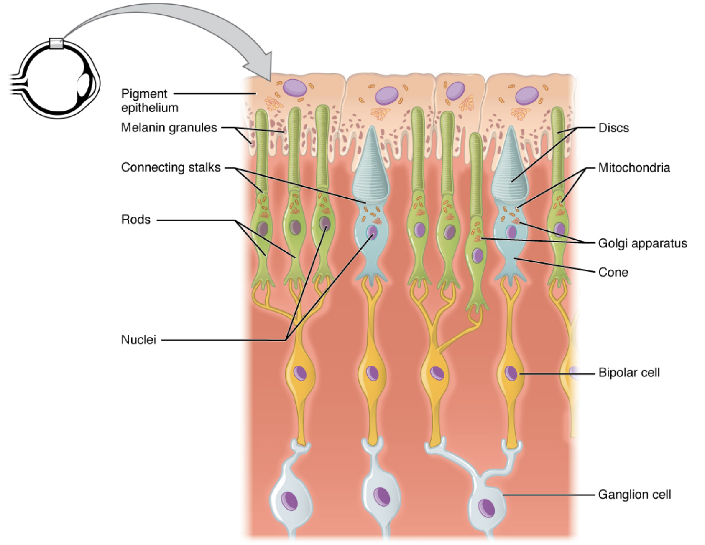

notes: so here is a little slice of you inner eye and you can see the rods and cones that are
responsible for seeing gray-ish (low light) and in color (cones)

---

## How Do Colors Work?

Rods (low-light) and cones (color) mediate vision. Humans have about 20 times
as many rods (120 million) as cones (6 million).

Cones see in the colors red, green and blue.

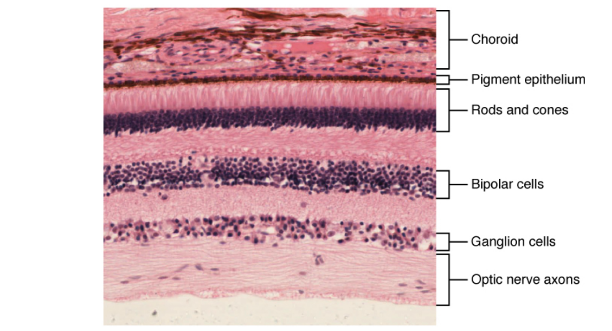

notes: here is that image again with an actual bit of the eye shown - the back of the
eye is where the optic nerve is & the front is where the choroid is

---

## Color Matching Function

The R,G, & B cones have different levels of responsiveness to different wavelenghts of light.

Below shows how responsive each type of cone is to a specific wavelength of light.

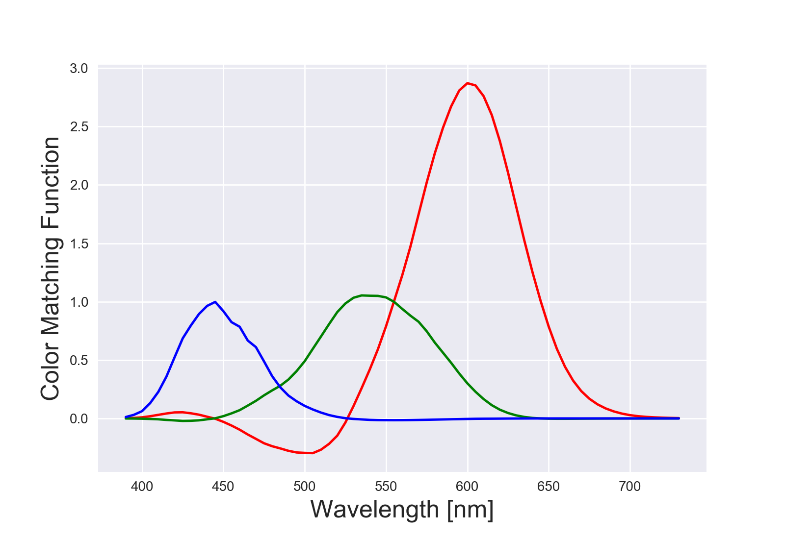

notes: here, you can think of this as how responsive your eye's cones are to different wavelengths.
You can see that your R cone is a lot more sensitive then there rest, especially at high wavelengths.

---

## Color Matching Function

The R,G, & B cones have different levels of responsiveness to different wavelenghts of light.

Below shows how responsive each type of cone is to a specific wavelength of light.

notes: here, you can think of this as how responsive your eye's cones are to different wavelengths.
You can see that your R cone is a lot more sensitive then there rest, especially at high wavelengths.

---

## Color Matching Function

The R,G, & B cones have different levels of responsiveness to different wavelenghts of light.

Below shows how responsive each type of cone is to a specific wavelength of light.

[Jupyter Notebook of Color Fundamentals](https://uiuc-ischool-dataviz.github.io/spring2019online/nbv.html?notebook_name=%2Fspring2019online%2Fweek05%2Fcolor_fundamentals.ipynb)

notes: there is a lot more of this with links to research in this jupyter notebook

---

## "Naming" Colors

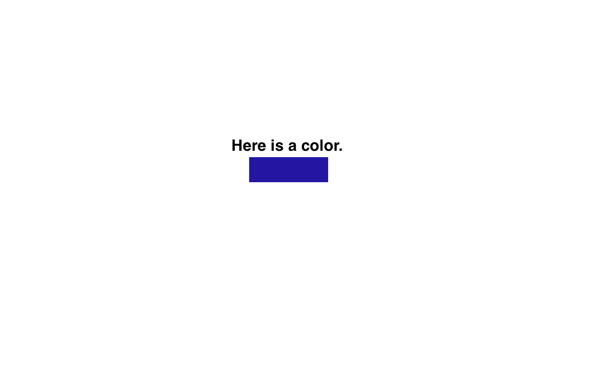

notes: so, we talk about how colors are named in different systems, and we'll cover the most basic here

---

## "Naming" Colors

notes: since we have RGB rods and cones, we might think the most natural way to represent this is with RGB colors

This color wheel doesn't give an accurate depiction of all the colors in RGB space
(since the space is actually 3d), but it is often
what you'll see out in the real world, and its pretty easy to see where our example color lies.

---

## "Naming" Colors

notes: another representation is Hue, Saturation, and Value

This depiction of HSV is in 3D here, and while its easier to visualize how colors change in the space, its
also hard to accurately mark where our specific one is.

---

## "Naming" Colors

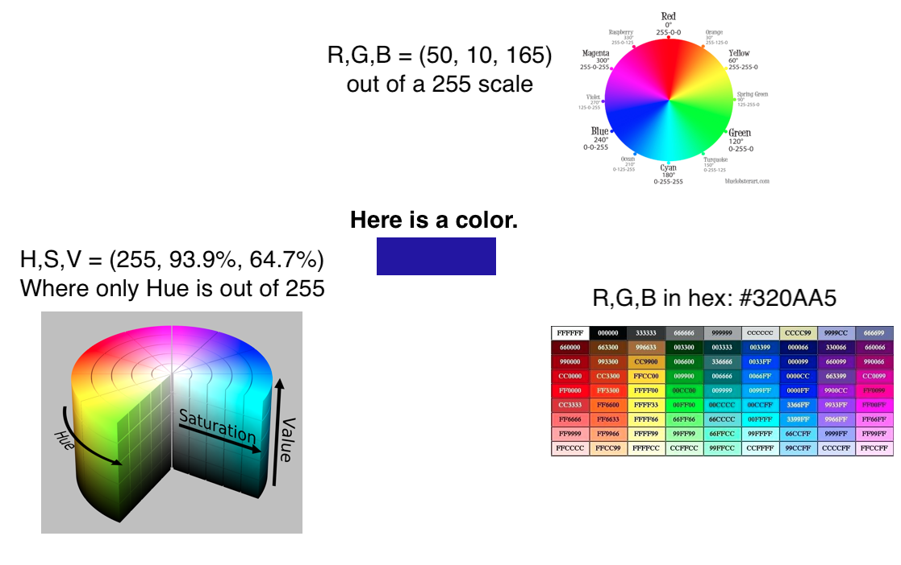

notes: here is another example - you'll see these codes a lot of you do html programming, but its another way to
specify colors with HEX numbers.  You'll note our color isn't listed here, but in a longer table it would be.

Hexadecimal only shows 16 million colors, RGB as uncompressed floats can theoretically represent quite a bit more (but there's a limitation of what monitors can display)

R = 2^8
G = 2^8
B = 2^8

RGB = 2^24 = 16 million

hexadecimal = 16^6 = 16 million

---

## "Naming" Colors: R,G,B Mapping

notes:
the mandrill image was an early color standardization image established by the Dept of Defense

Here we split it into its R, G, & B components

---

## "Naming" Colors: R,G,B Mapping - Its limitations

<table><tr>
<td> sRGB - graphics RGB</td>
<td>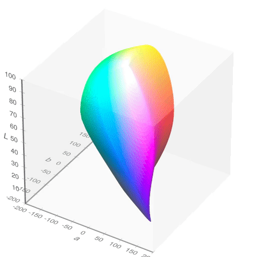 CIELAB - human RGB perception</td>
</tr></table>

notes:
this unified space of colors that works on most displays and printers is NOT the full range of human perception.

---

## "Naming" Colors: HSV

### HSV Wheel

https://commons.wikimedia.org/wiki/File:HSV_color_solid_cylinder.png

notes:
you can see that saturation and value are linear axes while hue is cyclical.

---

## "Naming" Colors: HSV

(Cycle is though (1) H to change color, (2) S to change to grayscale, (3) V black to white)

notes:
This video scans through different hues, which are the part of the rainbow you want

Then different saturations, which is how vibrant or gray the colors are

Then different values, which is how bright or dark the colors are.

Allow to run first and then comment.

---

## "Naming" Colors: Beyond HTML HEX - Specific Names

<table><tr>
<td>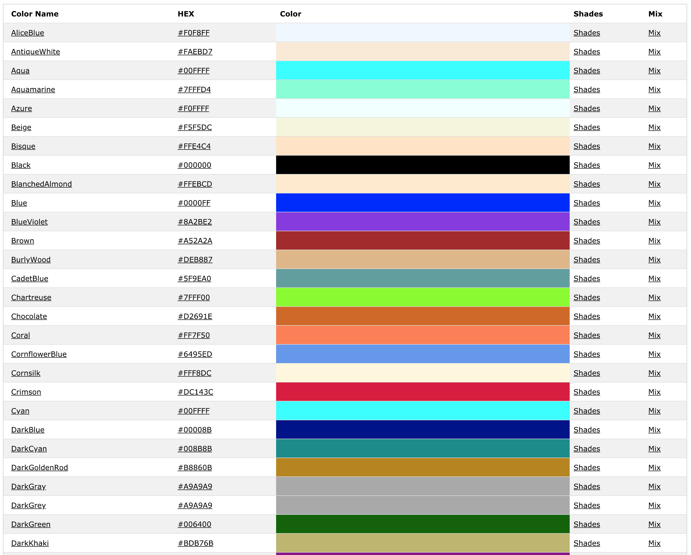 HTML</td>
<td> matplotlib</td>
</tr></table>

notes:
It's worth noting that "color words" are not consistent across languages or cultures. Color is a product of culture.

---

## "Naming" Colors: Summary

 * Color spaces 
   * HSV (Hue, saturation, value)
   * [CIELAB](https://en.wikipedia.org/wiki/CIELAB_color_space)
   * sRGB, Adobe sRGB
 * RGB triplets, sometimes compressed into hexadecimel ("#00FFAA", etc)
 * List of colors by name
   * [Web](https://www.w3schools.com/colors/colors_names.asp)
   * [matplotlib](https://matplotlib.org/2.0.2/examples/color/named_colors.html)

note: 
coding environments will often provide "named" colors if you're more interested in simplicity than flexible design
 
HSV is typically a color space used by color designers.

sRGB "standard RGB" is a color space that was standardized to unify different monitors and printers. 

CIELAB is the color space that covers the average of human vision.

---

 
 
 

# TOPIC 4: Color Maps

---

## Color Palettes

 * Resources:
  * [colorbrewer](http://colorbrewer2.org)
  * [palettable](www.palettable.io) (package)

notes:
there are a million websites that allow you to create color palettes

---

## Sequential Colormaps

notes:
these are also known as monochromatic

the hue doesn't change, but the value and the saturation do

---

## Diverging Colormaps

notes:
this shows you that different colors in the rainbow have different perceived brightness.

The outsides of this color map get darker while the center is brighter.

---

## Qualitative Colormaps

notes:
The blended areas of the continuous map here are kind of gross looking. This kind of random color map is best for categorical data that is NOT continuous.

---

## Color Meaning

<!---->

notes:
Which end of this is hot and which end is cold? What do red and blue mean?

red in the USA is bravery, but red in China is revolution

green in the western world is Christmas, but green in the eastern world is Islam

You're not always picking colors relative to each other, but relative to culture as well.

---

## Color Meaning

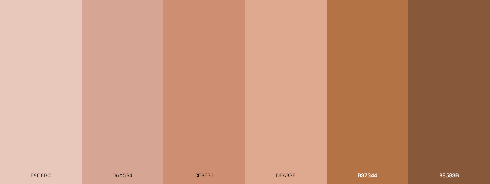

notes:
Human skin color is a particularly SENSITIVE area of color psychology. Western culture often treats dark colors as "mysterious" or "evil" and this is largely rooted in a history of racial bias.

---

## Just for fun: It's full of colors

https://commons.wikimedia.org/wiki/File:16777216colors.png

notes:
This grid is one way to show all the 16 million colors. They kind of get blurred out when looking at the image in this size, but if you zoom in at the link provided, you can see every pixel from red to green to blue, and from black to white.

---

## Pink: Is it a color?

Or, for that matter, where is brown or cyan in the spectrum?

https://gizmodo.com/if-the-color-pink-doesnt-scientifically-exist-why-can-1464266788

notes:
just a point of interest, what wavelength would you say magenta (or purple) is?

---

## Palette Mapping

Assign each value to a specific color or element.

---

## Palette Mapping

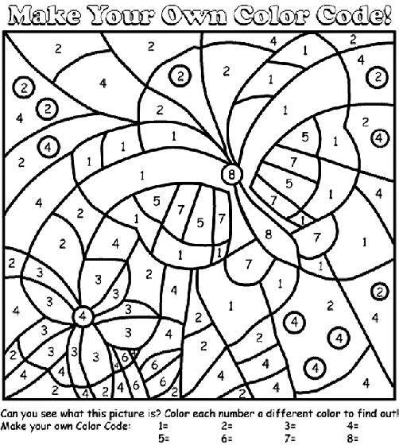

---

## Palette Mapping

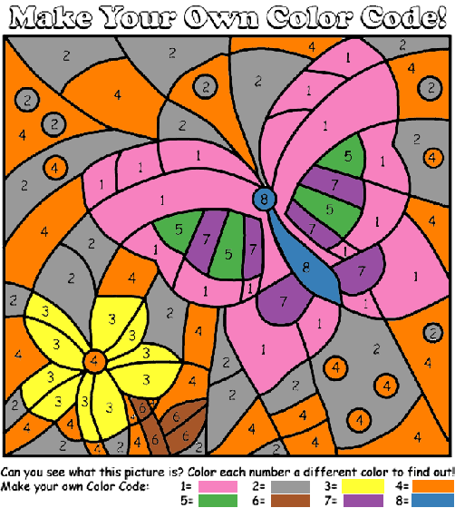

---

## Color Mapping: Normalizing Our Data

$f(v) \rightarrow (R, G, B)$

We can also re-map:

$f(v') \rightarrow (R, G, B)$

$v' = f(v)$

For instance, with logs or squares.

notes:
We can fit our continuous distribution linearly to a color map - so a low data value is at the beginning of the color map, a high value is at the top, and a middle value is halfway up the map.

Or we can remap it with exponents, or other mathematical operations.

---

## Color Mapping: Linear Normalization of Data

We map from a range of values to (0, 1):

$ v' = (v - v_0)/(v_1 - v_0) $

notes:
in order to get the data values to line up with the color bar - which goes from 0 to 1 - we have to transform our data into a range of 0 to 1. This can be as easy as dividing all value by the largest value, or we can do fancier things.

---

## Color Mapping: RGB Components of Some Colormaps

---

## Color Mapping: RGB Components of Some Colormaps

<!-- .slide: data-background-image="images/gist_stern_colors.png" data-background-size="auto 65%" -->

---

## Color Mapping: RGB Components of Some Colormaps

<!-- .slide: data-background-image="images/gray_colors.png" data-background-size="auto 65%" -->

---

## Color Mapping: RGB Components of Some Colormaps

<!-- .slide: data-background-image="images/jet_colors.png" data-background-size="auto 65%" -->

---

## Color Mapping: RGB Components of Some Colormaps

<!-- .slide: data-background-image="images/magma_colors.png" data-background-size="auto 65%" -->

---

## Color Blindness

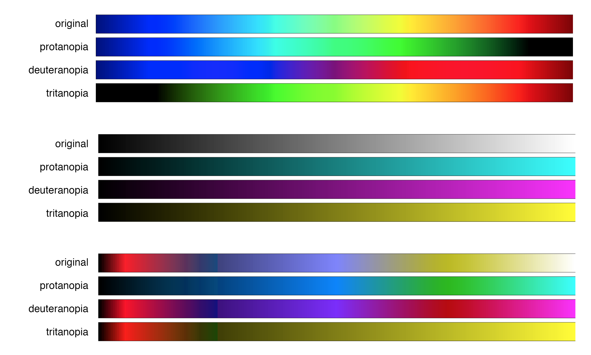

notes:
these are not the only types of color blindness, just the types where one of the three types of cone are missing. Sometimes that third cone is just "anomalous", and sometimes more than one cone is missing, but it's much rarer.

You can see that designing for a color blind person can be difficult if you put all the information into one cone. You catch a wider audience by using the colors between the cones, like yellow, cyan, and magenta.

protanopia = no red
deuteranopia = no green
trianopia = no blue

---

## Color Blindness

http://enchroma.com/test/instructions/

---

## Colormaps: Loading Data

Colormaps in Python - with the Michigan data and the scan data, we'll evaluate:

 * How to choose a colormap
 * What are some good "bounds" for that colormap
 * How do we set our color normalizations and transformations?

---

# To Python!

---

## Assignment 5

Load in a 2D data set with pandas/numpy or Pillow - you may select one of the datasets we have used in class (Lake Michigan, Brain Scan, or an image).

Construct 3 different visualizations of this dataset, each with a different colormap.  The color maps can differ by color pallette, color scale, color limits, etc or some combination there of.

Discuss the pros and cons of each visualization - what does your colormap highlight? Ignore? Will it confuse the viewer in anyway? Anything else you think a viewer should know about your choices?

Each component will be worth 5 points and must be a completely communicative visualization -- including labels and a one paragraph writeup of successes and shortcomings in your approach. Submit a notebook to Moodle. All source code must be in these files.

