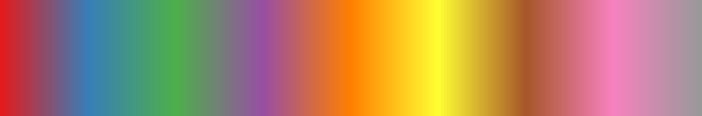

<!-- .slide: class="titleslide" -->

# Data Visualization

<div style="height: 6.0em;"></div>

## Matthew Turk
## Fall 2019
## Lecture 3

---

## Warm-Up Activity

1. What is the visualization trying to show?
1. What are its methods?
1. What are the strengths / weaknesses?

http://old.vijayp.ca/blog/2012/06/colours-in-movie-posters-since-1914/
http://moviebarcode.tumblr.com/

---

## Today's Topics

 * Getting started with Python viz
 * Transformations
 * Colors
 * Color mapping
 * Data Characteristics
 * Choosing Visualizations

---

## Whole Tale

We'll be using Whole Tale for visualization today.

Go to [wholetale.org](https://wholetale.org) and find the tale "IS590DV Week 3".

We will do some _basic_ pandas and visualization.

---

## Transformations

Affine transformations satisfy:

$ \vec{y} = A\vec{x} + \vec{b} $

<!-- .slide: data-background-image="images/affine_1.svg" data-background-size="30% auto" data-background-position="right 20% bottom 50%" -->

---

## Transformations

Affine transformations satisfy:

$ \vec{y} = A\vec{x} + \vec{b} $

We can use these to accomplish:

 * Shifts

<!-- .slide: data-background-image="images/affine_2.svg" data-background-size="30% auto" data-background-position="right 20% bottom 50%" -->

---

## Transformations

Affine transformations satisfy:

$ \vec{y} = A\vec{x} + \vec{b} $

We can use these to accomplish:

 * Shifts
 * Rotations

<!-- .slide: data-background-image="images/affine_3.svg" data-background-size="30% auto" data-background-position="right 20% bottom 50%" -->

---

## Transformations

Affine transformations satisfy:

$ \vec{y} = A\vec{x} + \vec{b} $

We can use these to accomplish:

 * Shifts
 * Rotations
 * Scaling

<!-- .slide: data-background-image="images/affine_4.svg" data-background-size="30% auto" data-background-position="right 20% bottom 50%" -->

---

## Choosing a Visualization

When we are examining data, what can we look for?

 * Does this data describe a **geometric** object?
 * Are the data points **connected** to each other?
 * Can we describe data points with a fixed set of **categories**?
 * Is there a **quantity** associated with the data?
 * Are the datapoints **continuous** along one or more dimensions?

---

## Categories and Continuity

Today we'll talk about representing things based on categories and based on
continuities.

---

## How Do Colors Work?

Rods (low-light) and cones (color) mediate vision. Humans have about 20 times
as many rods (120 million) as cones (6 million).

https://upload.wikimedia.org/wikipedia/commons/e/e8/1414_Rods_and_Cones.jpg
By OpenStax College [CC BY 3.0](http://creativecommons.org/licenses/by/3.0),
via Wikimedia Commons

---

## Let's Try It

http://enchroma.com/test/instructions/

---

## Color Matching Function

<!-- .slide: data-background-image="images/cmf.png" data-background-size="auto 75%" -->

---

## Responsivity Function

<!-- .slide: data-background-image="images/resp.png" data-background-size="auto 75%" -->

---

## "Naming" Colors

 * RGB triplets, often expressed in hexadecimel ("#00FFAA", etc)
 * Color spaces 
   * HSV (Hue, saturation, value)
   * [CIELAB](https://en.wikipedia.org/wiki/CIELAB_color_space)
   * sRGB, Adobe sRGB
 * List of colors by name
   * [Web](https://www.w3schools.com/colors/colors_names.asp)
   * [matplotlib](https://matplotlib.org/2.0.2/examples/color/named_colors.html)

---

## Color Palettes

 * Colorbrewer Categories
   * Sequential
   * Diverging
   * Qualitative
 * Resources:
  * colorbrewer.org
  * palettable (package)

---

## Sequential Colormaps


---

## Diverging Colormaps


---

## Qualitative Colormaps




(See?  Works better as discrete!)

---

## It's full of colors

https://commons.wikimedia.org/wiki/File:16777216colors.png

---

## HSV Wheel

https://commons.wikimedia.org/wiki/File:HSV_color_solid_cylinder.png

By HSV_color_solid_cylinder.png: SharkD derivative work: SharkD Talk [CC BY-SA 3.0
(http://creativecommons.org/licenses/by-sa/3.0) or GFDL
(http://www.gnu.org/copyleft/fdl.html)], via Wikimedia Commons

---

## Palette Mapping


Assign each value to a specific color or element.

---

## Color Mapping

$f(v) \rightarrow (R, G, B)$

We can also re-map:

$f(v') \rightarrow (R, G, B)$

$v' = f(v)$

For instance, with logs or squares.

---

## Color Mapping: Linear Mapping

We map from a range of values to (0, 1):

$ v' = (v - v_0)/(v_1 - v_0) $

---

<!-- .slide: data-background-image="images/gist_stern_colors.png" data-background-size="auto 75%" -->

---

<!-- .slide: data-background-image="images/gray_colors.png" data-background-size="auto 75%" -->

---

<!-- .slide: data-background-image="images/jet_colors.png" data-background-size="auto 75%" -->

---

<!-- .slide: data-background-image="images/magma_colors.png" data-background-size="auto 75%" -->

---

<!-- .slide: data-background-image="images/viridis_colors.png" data-background-size="auto 75%" -->

---

<!-- .slide: data-background-image="images/flag_colors.png" data-background-size="auto 75%" -->

---

<!-- .slide: data-background-image="images/gist_stern_3d.png" data-background-size="auto 75%" -->

---

<!-- .slide: data-background-image="images/gray_3d.png" data-background-size="auto 75%" -->

---

<!-- .slide: data-background-image="images/jet_3d.png" data-background-size="auto 75%" -->

---

<!-- .slide: data-background-image="images/magma_3d.png" data-background-size="auto 75%" -->

---

<!-- .slide: data-background-image="images/viridis_3d.png" data-background-size="auto 75%" -->

---

<!-- .slide: data-background-image="images/flag_3d.png" data-background-size="auto 75%" -->

---

## Colormaps: Loading Data

Today we will explore images and colors, and how our choice of colormaps
affects our perception of them.

You will need to load data into your notebook, which you can do using these
commands:

```
import numpy as np
import h5py

fn1 = "/home/shared/sp18-is590dv/data/michigan_lld/michigan_lld.flt"
michigan = np.fromfile(fn1, dtype='f4').reshape((5365, 4201))

fn2 = "/home/shared/sp18-is590dv/data/single_dicom.h5"
with h5py.File(fn2) as f:
    scan = f["/scan"][:]
```

---

## Colormaps: Prep Work

We will now utilize the `plt.imshow` command to show these images, and discuss
how to modify the transformation of the data beforehand.

---

## Colormaps

With the Michigan data and the scan data, evaluate:

 * How to choose a colormap
 * What are some good "bounds" for that colormap
 * How do we set our transform?

---

## Assignment 2

Using matplotlib, construct a visualization of the Illinois Building Inventory
that communicates the following information:

 * Relationship between the year acquired and the year constructed
 * Total square footage as a function of congressional district
 * Average square footage per floor as a function of congressional district
 * Square footage for the five most common departments as a function of year

Each component will be worth 5 points and *must* be a completely communicative
visualization -- including labels and a one paragraph writeup of successes and
shortcomings in your approach.  Submit a notebook to Moodle.  All source code
must be in these files.
