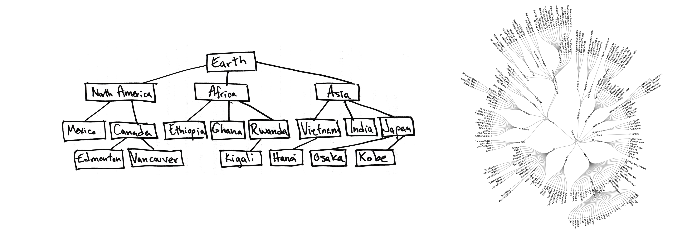
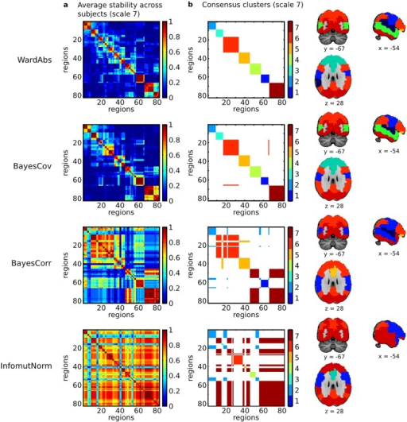
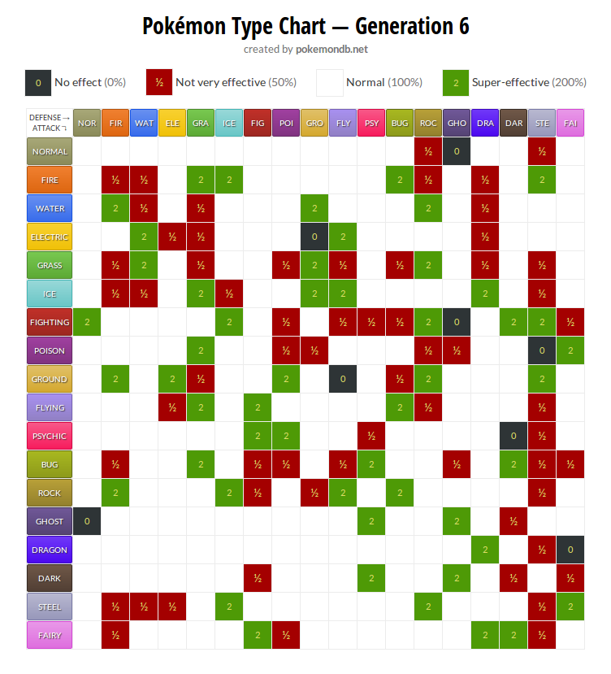
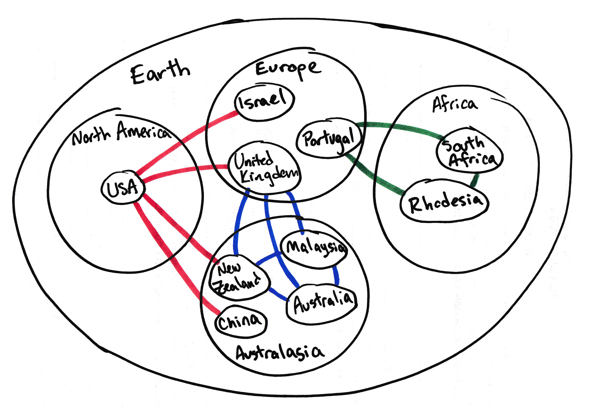

<!-- .slide: class="titleslide" -->

# Data Visualization

## Jill P. Naiman
## Spring 2020
## Lecture 9

---

## Warm-Up Activity

 1. What is the visualization trying to show?
 1. What are its methods?
 1. What are the strengths / weaknesses?

[XKCD Money](https://xkcd.com/980/huge)

---

## This week

notes:
this week we'll talk a bit about network visualization and also look at a tool to make word clouds in Python

---

## This week

 1. Networked & Hierarchical Data
 1. Word Clouds
 1. Final Project
    * Viz for Self
    * Viz for Peers
    * Viz for Others

notes:
we'll talk more about these things next week for the final project!

---

 
 
 

# Topic 1: Networked & Hierarchical Data

---

## Networked and Hierarchical Data

 1. Node-link diagrams
 1. Matrix views

From: <a href="https://www.researchgate.net/publication/258716465_Visualizing_Weighted_Networks_A_Performance_Comparison_of_Adjacency_Matrices_versus_Node-link_Diagrams">this article</a>

notes:
There are two primary types of visualization for data that has inherent linkages.

This figure here is actually showing the same networked dataset.

---

## Node-link Diagrams

 1. Trees
 1. Force-Directed Graphs

notes:
These are the primary ways that you would draw a linked node diagram.

You might have different sizes of symbols, different shapes, or different link or symbol colors to encode other information.

---

## Node-link Diagrams

 1. Trees
 1. Force-Directed Graphs

From: <a href="https://github.com/jcatw/snap-facebook">this GitHub</a>

notes: in the python lecture we'll be working with a subset of this facebook dataset - showing linkages between individuals as their facebook friendships

this is a node-link diagram of this full facebook dataset showing groups of connected individuals, and how the groups are connected to eachother.

---

## Node-link Diagrams

 1. Nodes
   * might have 0-to-many edges linked to them
 1. Edges (sometimes called "links")
   * associated specifically with 2 nodes
   * can have a direction
   * can have a weight

notes:
This is a diagram of some selected military alliances during the Cold War.

---

## Node-link Diagrams

 1. Nodes
   * might have 0-to-many edges linked to them
 1. Edges
   * associated specifically with 2 nodes
   * can have a direction
   * can have a weight

notes:
One common use-case for these is genetics. Scientists need visualizations to understand how one gene affects another, either directly OR **indirectly**.

here is shown an example of how the BRCA genes associated with some forms of breast cancer are linked to various other genes.

---

## Tree Diagrams

 * Topological
 * Ordered
   * Left-to-Right
   * Inside-Out
   * Top-to-bottom
 * Always one incoming edge (low density)
 * Discrete, not Continuous

notes:
trees have a topology or hierarchy. These are especially good for a *deep* hierarchy.

The physical space between nodes isn't meaningful like it would be in a scatter plot. Rather the number of "hops" along edges is important.

The left hand plot has a top-down ordering, while the right-hand plot is ordered radially such that the most connected object is at the center.

---

## Force-Directed Graphs

 * Nodes push away from each other as if their edges are springs.
 * Nodes push away from each other by local repulsion force.
 * Forces can be weighted.

notes:
These use simulated forces to push apart what might otherwise look like a mad hairball.

Edge springyness can be weighted by edge weight, node repulsion can be weighted by node weight. (We'll play with this)

You could place the points in any arbitrary place and let them evolve. You could start with a scatter plot representing numerical values, but the nodes will just move. You could also put all the points at the same starting place.

Note that this means these plots are in a sense "non-deterministic" in that you can get slightly different plots every time. 

---

## Force-Directed Graphs

 * Path Distance
 * Joint or Disjoint
 * Discrete, not Continuous

notes:
These are useful for identifying clusters, finding all possible paths, finding the shortest path, finding all adjacent nodes, finding bridges between unconnected nodes, etc.

---

## Force-Directed Graphs

 1. Drawbacks:
   * Non-deterministic (different every time)
   * Link Density can be an issue when over 3-4 links per node

notes:
this is a social network graph that looks fine at high resolution, but on this screen is more or less unreadable.

---

## Matrix Views

 1. Adjacency Matrix
   * List all values along X AND Y axes

</td>
</td>

notes:
Matrix views remove occlusion and hairball issues completely. They are preferred for extremely dense data.

However they do not show topology, and they might be less intuitive to identify clustering.

---

## Matrix Views

 1. Adjacency Matrix
   * List all values along X AND Y axes
   * Can cut in half along diagonal if non-directional

notes:
This is sometimes called a "Folded" adjacency matrix

---

## Matrix Views

 1. Adjacency Matrix
   * List all values along X AND Y axes
   * Can cut in half along diagonal if non-directional
   * Color cells by edge weight

notes:
Matrix views remove occlusion and hairball issues completely. They are preferred for extremely dense data.

However they do not show topology, and they might be less intuitive to identify clustering.

As you can see by the square plots here - these are supposed to show the networked structure of some brain data - can you easily pick out what variables are linked? (I can't!)

---

## Matrix Views

notes:
Pokemon type-effectiveness chart yay!

So, AJ (the other instructor) put this in and I think I'd be remiss if I didn't show it, but I literally have no idea what is going on here - does anybody here play pokeman and can explain it to the class?

Notice this is directional - Attackers and Defenders don't have same effect on different types.

---

## Hierarchical Data

 1. Trees
 1. Containment
   1. Treemaps

notes:
Another way to look at networked data - treemaps

containment better at shallow, broad trees than node-link tree diagrams

good for identifying topological outliers

This visualization is file size of the D3 visualization library.

---

## Hierarchical Data

 1. Trees
 1. Containment
   1. Treemaps
   1. Nested Circles

notes:
This is also known as circle-packing.

---

## Compound Networks

 1. Network and Tree together

notes:
Now we're combining a hierarchical nested circle containment WITH linked nodes from our cold war alliances.

There are lots of ways to combine types of network visualizations like this.

---

## An aside: <a href="https://en.wikipedia.org/wiki/Hilma_af_Klint">Hilma af Klint</a>

---

## An aside: <a href="https://en.wikipedia.org/wiki/Hilma_af_Klint">Hilma af Klint</a>

---

## Today's Python: Networks & Word clouds

notes:
today we will mainly focus on network viz, but I want to show a bit about a word cloud viz package you might want to play around with and a bit about how to upload text and mainpulate it!

---

 
 
 

# Topic 3: Intro to Final Project

---

## Final Project

There are three components, turned in the last three weeks of class.

You will have three components:

1. Viz for Self (Due April 13)
1. Viz for Peers (Due April 20)
1. Viz for Others (Due April 27)

---

## Final Project: Part 1

Submit in a Jupyter notebook.

 * Identify a dataset to explore.
   * This will be iterative!  You probably won't get one you like on the first
     try.
   * Check out sources like [data.world](https://data.world/),
     [data.illinois.gov](https://data.illinois.gov/),
     [data.gov](https://data.gov/),
     [developer.marvel.com](https://developer.marvel.com/),
     [IDB](https://databank.illinois.edu/), etc.
   * or the dataset doc that [lives right here](https://docs.google.com/document/d/15UJinT5XokAHXd9fQAYD8f6d3vEkR6kJMq8kswmkOhY/edit?usp=sharing)
 * Explore the dataset in a Jupyter notebook.  Make sure you include things that did and did not work.
 * Summarize the characteristics of the dataset in words: what does it
   represent, what are the fields/columns/rows, what data types are they, etc

---

## Final Project: Part 1 (cont)

Your datasets need to be submitted as well.  To do this, include this
information in your Jupyter notebook:

 * What is the "name" of the dataset?
 * Where did you obtain it?
 * Where can we obtain it?  (i.e., URL)
 * What is the license of the dataset?  What are we allowed to do with it?
 * How big is it in file size and in items?
 * Make a simple plot showing a relationship of interest.  You can use matplotlib or pandas (or other). Don't worry about colors, labels or anything else of that nature!

---

## Final Project: Part 1 (cont, cont)

Per usual, there will be a class google doc for this assignment.

You can share raw data sets and sources, ask questions about reading/modifying the dataset and post code to do so **that isn't working**.

Please do not share processed or cleaned datasets.

---

## Final Project: Part 2

Submit in a Jupyter notebook.  

 * Using your dataset, generate visualizations that explore the data in a
   guided way.
 * Your first component was focused on exploring the data in an unguided way.
   This component is about visualizing the data in a guided way.
 * Construct visualizations that explore each aspect you identified, with
   discussion and descriptions.
 * If you can identify improvements to the visualizations that come from
   interactivity, implement that.

---

## Final Project: Part 2 (cont)

 * The visualizations should utilize visual language relevant for "Viz for
   Peers."
    * Each and every plot should contain all relevant information: appropriate
      units, labeling, etc
    * Annotate and narrate particular pieces of interest (if there are any)
    * Use standard visual representations and augment these if necessary

---

## Final Project: Part 3

You will submit this as your final project in week 14 and get some feedback.

### In flux:

For week 15, everbody will share their viz for a few minutes in class
(tech willing).  This doesn't have to be a formal presentation, just a quick screen-share and a few
comments about what you have been working on.

---

## Final Project: Part 3 (cont)

You may submit one or more of the following items: Idyll webpage repository, narrative Jupyter notebook.

This component will include a "for others" visualization that is deeply
narrative with appropriate interactive (or static) content and, ideally, sharable on a
website.

Some possible ways to approach this:

 * Infographic
 * Idyll
 * Jupyter notebook
 * Raw HTML

---

 

# To Python!
