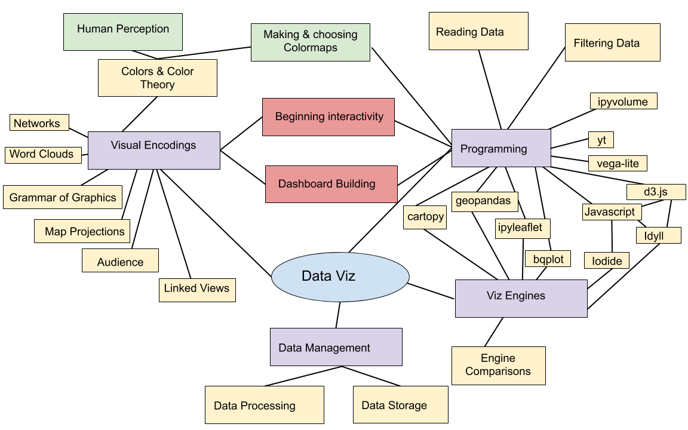

<!-- .slide: class="titleslide" -->

# Data Visualization

## Jill P. Naiman
## Spring 2020
## Lecture 15

---

 
 
 

## You made it!

notes:
congrats! you did it!  You made it to the end of the course during a super tough time!

---

## This Course

notes:
So, look at all the STUFF we covered!  Look at all that!

---

## Today

 1. Resources & Where to go from here
 1. More Idyll and d3.js stuff
 
notes: 
I'm just going to mention briefly some resources you might want to check out and then we'll continue on to finish some more Idyll + d3 type things

---

 
 
 

# TOPIC 1: Where to go from here

notes:
different sub-fields of dataviz will lead you down different pathways

---

## Python

 * See whats in dev on the [bqplot gitter lobby](https://gitter.im/bloomberg/bqplot)
 * More about volume rendering with [ipyvolume](https://ipyvolume.readthedocs.io/en/latest/)
 * More about sciviz dev with [yt slack](https://yt-project.slack.com/join/shared_invite/enQtMzQ4Nzk1Mjk0ODY4LWNmOTFiNTM4N2ExZWYyY2YwZDUxN2Q1MTgwNDdjZGExMWM0Y2VlNzUzNGExZTZhMWRlNjU3ZjFmZmU3MjdkNDg)

notes:
these are notes

---

## Javascript

 * [Beginning Javascript course](https://www.codecademy.com/learn/introduction-to-javascript)
 * See what's in dev on the [Idyll gitter lobby](https://gitter.im/idyll-lang/Lobby) - including updates to vega-lite!

---

## Courses

 * [Advanced Data Visualization, iSchool](https://ischool.illinois.edu/degrees-programs/courses/is590adv)
 * [Museum Informatics](https://ischool.illinois.edu/degrees-programs/courses/is461)
 * [Data Science Storytelling](https://ischool.illinois.edu/degrees-programs/courses/is590dst)
 * [More on sciviz and graphics](https://jnaiman.github.io/csci-p-14110/) (Not UIUC, includes intro to programming)
